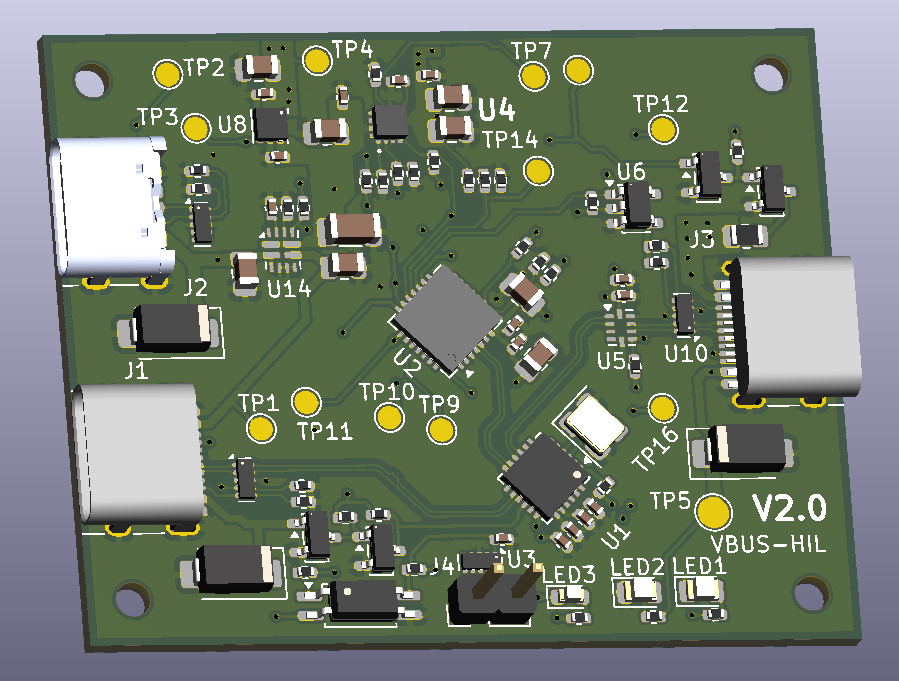
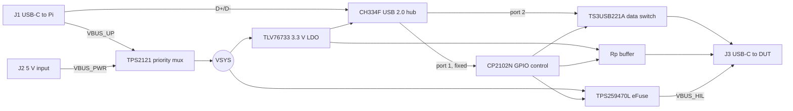

# HIL USB-C Control

A bench device that sits between a Raspberry Pi and a USB-C device under test (DUT). Host software gets controlled access to the DUT's USB 2.0 data, USB-C CC attachment and 5 V VBUS, so it can emulate unplugging and reconnecting the DUT without touching its cable.

It is intended for controlled hardware-in-the-loop (HIL) lab rigs. It is not a general-purpose USB-C charger, dock or power-distribution product.



## Features

- USB 2.0 high-speed hub with a fixed on-board control interface. The Pi always sees the controller, whether or not a DUT is connected.
- Software-controlled J3 (DUT) state: data, CC/Rp and 5 V VBUS are switched independently.
- Priority power mux: external 5 V on J2 is preferred; J1 (the Pi) is the fallback and is reverse-blocked when J2 is valid.
- J3 VBUS is protected by an eFuse (about 3.6 A typical, below 4.0 A worst case) with over-voltage protection, fault reporting and active discharge.
- Fixed 3 A Rp advertisement on J3. No USB PD, BC1.2, VCONN, SuperSpeed or alternate modes.
- One opto-buffered external control line (J4) and test points for the key rails and signals.
- Controlled via `libgpiod` on the standard Linux `cp210x` gpiochip.

## Connectors

| Ref | Role |
|---|---|
| J1 | USB-C upstream to the Raspberry Pi: USB 2.0 data, and fallback VBUS |
| J2 | USB-C 5 V power input (power only, no data). Preferred over J1 |
| J3 | USB-C downstream to the DUT: switched data, CC and VBUS |
| J4 | External opto-buffered control line |

## Architecture



| Function | Part |
|---|---|
| USB 2.0 hub | CH334F |
| Control IC | CP2102N-A02 (7 GPIO) |
| Power mux | TPS2121 |
| J3 eFuse | TPS259470L |
| Data switch | TS3USB221A |
| 3.3 V LDO | TLV76733 |
| Rp buffer | SN74LVC1G125 |
| ESD | TPD4E05U06 |

Board: 4 layers, 50 x 40 mm, top-side SMT, designed for JLCPCB assembly.

## Operating cases

| Case | Power source | Use |
|---|---|---|
| A. Pi-powered | J1 only | Low-current DUTs only. Enumeration, data path and low-power control. |
| B. External 5 V | J2, with the Pi supplying data on J1 | Normal mode for high-current tests. The source must supply the DUT load plus about 0.1 A board consumption (at least 3.5 A for a 3 A DUT). |
| C. Split-cable | External 5 V on J1 VBUS, Pi supplies data and GND | Qualified fixtures only. The Pi-side VBUS must be isolated from the external supply. |

J1 and J2 accept regulated 5 V only. Sustained 12 V or 20 V input is outside the product contract.

## Software contract

Software owns the state machine. The hardware does not detect DUT attach and does not enforce source capability.

- **Disconnect:** data off, wait 20 ms, CC off, wait 20 ms, VBUS off, then wait for the discharge confirmation.
- **Connect:** CC on, VBUS on, confirm VBUS present and no fault, wait 40 ms, data on.

Before a high-current test, confirm that J2 is powering the board. Turn J3 VBUS off before planned J2 removal. The CP2102N GPIO map, configuration image and a control-service example are in [architecture/architecture_final.md](architecture/architecture_final.md) section 6.

## Repository layout

| Path | Contents |
|---|---|
| [product_description.md](product_description.md) | Product requirements, operating cases, accepted limitations, acceptance checks |
| [architecture/architecture_final.md](architecture/architecture_final.md) | Schematic-level architecture, power budget, GPIO map, BOM, risks, prototype tests |
| [architecture/schematic_overview.md](architecture/schematic_overview.md) | Schematic overview |
| [architecture/pcb_floor_plan.md](architecture/pcb_floor_plan.md) | PCB floor plan and layout constraints |
| [llm-kicad/](llm-kicad/) | KiCad 10 project (hierarchical schematic, PCB, custom symbols) |
| [llm-kicad/schematic_review_report.md](llm-kicad/schematic_review_report.md) | Schematic review report and finding log |
| [tools/](tools/) | Audit and helper scripts |

The schematic sheets are `01_power_cc`, `02_usb_hub_control`, `03_dut_interface` and `04_test_validation`. Open `llm-kicad/llm-kicad.kicad_pro` in KiCad 10.

## Tools

`tools/audit_schematic.py` checks symbol pin numbers against placed footprint pad numbers, schematic versus PCB footprint sync, `Value` text versus the JLCPCB catalogue part, and `Datasheet` coverage. It exits non-zero if the pin/pad or footprint-sync checks fail.

```sh
python3 tools/audit_schematic.py
```

## Known limitations

- Fixed 3 A Rp: the advertisement can exceed the active source's real capacity.
- No hardware DUT-attach detection: an unplugged DUT can leave J3 VBUS live until software disables it.
- A single priority mux is the only isolation between J1 and J2. It is not an independent-source isolator, and a split cable that joins an external supply to the Pi is not protected against.
- No per-input current limit or input over-voltage disconnect.

The full list and the release acceptance checks are in [product_description.md](product_description.md) sections 7 to 9.

## Status

Hardware revision V2.0. Before release, see the open items in the schematic review report and the mandatory prototype tests in [architecture/architecture_final.md](architecture/architecture_final.md) section 10. The CP2102N must be programmed with the configuration image before use.
