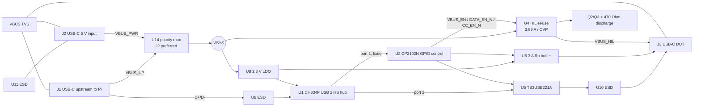
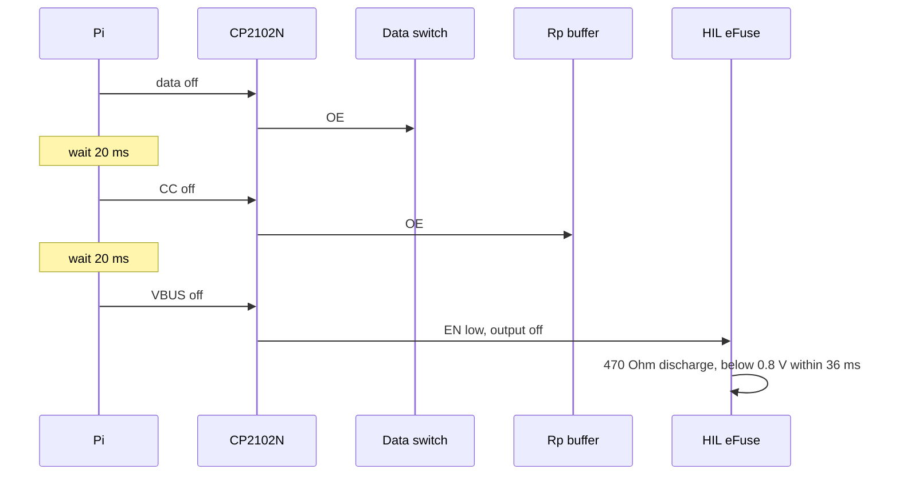
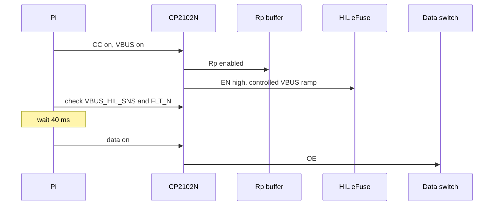
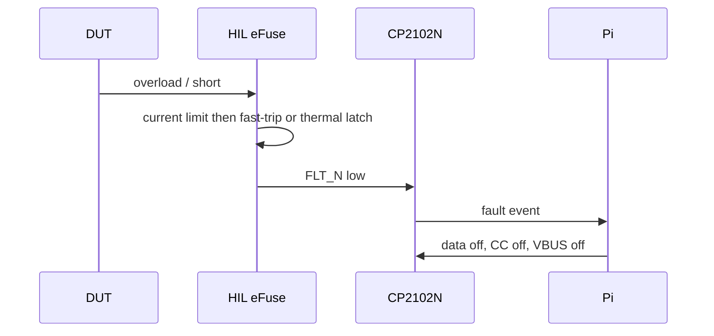

# HIL USB-C Control - Schematic-Level Architecture (v1)

Status: Draft for review round 1. This is a complete, standalone architecture derived from `product_description.md`; prior designs are archived in `architecture/V1/`.

## 0. Scope and decisions

| Area | Decision |
|---|---|
| USB topology | USB 2.0 High-Speed hub: one permanent control port and one switchable DUT port |
| Control IC | CP2102N-A02-GQFN28, exposed to Linux as a `cp210x` gpiochip |
| Input power | U14 TPS2121RUXR (C485916) J2-preferred dual-input priority mux with reverse-current blocking; J1 is the fallback |
| HIL power | One TPS259470L eFuse on J3 VBUS: 3.89 A current limit, OVP, fault output, controlled ramp and discharge |
| HIL CC | Software-enabled fixed 3 A Rp from 3.3 V: 4.79 kOhm per CC pin |
| Safety policy | Software sequences CC, VBUS and data. There is no hardware DUT-attach detector or source-capability detector. |
| PCB | Four layers, target 60 x 40 mm, no enclosure, top-side SMT with through-hole connector-shell pegs |
| Excluded | USB 3.x, USB PD, BC1.2, SBU, VCONN, DisplayPort and barrel jack |

**Qualified-input boundary:** J1 and J2 accept regulated 5 V only. They are not specified to survive or block a sustained 12 V or 20 V input. A USB-C PD source remains at vSafe5V because the board has no PD communication, but a PD trigger, a non-compliant source, or a 12 V supply is outside the product contract. Input TVS devices handle ESD and short hot-plug transients, not a sustained wrong-voltage supply.

## 1. Requirements traceability

| Requirement / scenario | How v1 satisfies it |
|---|---|
| Pi host, DUT device | J1 is the USB-C upstream connection to the Pi USB-A host port. J3 is a downstream USB-C DFP. |
| USB 2.0 HS only | CH334F hub, TS3USB221A HS switch, 90 Ohm differential routing and 0.5 pF ESD arrays. |
| Control survives DUT disconnect | CP2102N is fixed on hub port 1; only hub port 2 to J3 is switched. |
| Emulated unplug | U5 opens D+/D-, U6 removes Rp, U4 opens/discharges VBUS; software timing is mandatory. |
| Pi-powered low-current test | U14 selects J1 when J2 is absent. Software only permits a known low-current DUT. |
| External 3 A test | U14 selects J2 whenever valid. Fixture requires 5 V, at least 3.5 A, including board load. |
| Split-cable fixture | J1 accepts isolated external VBUS while Pi provides D+/D-/GND. A cable that ties external VBUS to the Pi is prohibited. |
| Never back-feed Pi | U14 reverse-blocks both inputs; J1 carries no HIL load when J2 is present. |
| HIL overload / short | U4 current limit, fast-trip, thermal latch-off and `HIL_FLT_N` report to software. |
| Deterministic default | CP2102N reset latches and pull resistors keep data open, Rp off, U4 EN low and discharge on. |
| Input fault scope | Only qualified 5 V inputs supported; connector TVS covers ESD/transients, not sustained 12/20 V. |

## 2. Topology and control-IC evaluation

| Option | Evaluation | Decision |
|---|---|---|
| USB 2.0 hub with separate control and DUT ports | Control stays enumerated while J3 is removed; true downstream data isolation is possible. | **Selected** |
| USB mux/data switch only | The CP2102N and DUT cannot coexist on one Pi port. | Rejected |
| Hub port power control only | Does not remove CC or guarantee D+/D- isolation. | Rejected |
| MCU plus hub | Enables richer policy and telemetry but adds firmware, update and debug responsibility. | Rejected for v1 |

| Candidate | GPIO and Linux support | Cost / availability posture | Result |
|---|---|---|---|
| Original CP2102 | No general GPIO | Inadequate | Rejected |
| **CP2102N-A02** | Seven GPIO lines through upstream `cp210x` gpiochip; `libgpiod` control | JLC Extended, archived C964632 | **Selected** |
| CH340 / CH9102 | Serial control only; no suitable standard gpiochip path | Low cost but insufficient GPIO | Rejected |
| FT231X / FT232H | GPIO through `ftdi_sio` / MPSSE | Higher cost; valid fallback | Alternative |
| RP2040 / CH32V / STM32 | Full GPIO and logic via CDC serial | Needs maintained firmware | Rejected |

## 3. Block diagram



## 4. Power tree and budget

| Rail | Source / path | Design current | Function |
|---|---|---:|---|
| VBUS_UP | J1 | Pi-port-limited | Low-current fallback source |
| VBUS_PWR | J2 | Qualified 5 V / >=3.5 A | Preferred high-current source |
| VSYS | U14 priority mux | 4.2 A | Board and U4 input |
| +3V3 | U8 TLV76733DRVR | 150 mA | Hub, CP2102N, U5/U6, LEDs |
| VBUS_HIL | U4 TPS259470L | 3.89 A nominal | DUT power |

| Consumer | Rail | Typical | Maximum / allowance |
|---|---:|---:|---:|
| CH334F | +3V3 | 42 mA | 85 mA |
| CP2102N | +3V3 | 9.5 mA | 14 mA |
| U5/U6 and logic | +3V3 | 1 mA | 3 mA |
| LEDs | mixed | 5 mA | 7 mA |
| Regulators / mux Iq | VSYS | 2 mA | 5 mA |
| Board total | VSYS | about 60 mA | 115 mA |

A full 3 A DUT requires at least 3.115 A before connector/cable headroom. The specified J2 fixture source is 5 V and at least 3.5 A. A nominal 3 A charger is not a full-3-A DUT source.

## 5. Schematic implementation

### 5.1 Connectors, power mux and 3.3 V rail

- **J1/J3:** TYPE-C-31-M-12, 16-pin USB 2.0 receptacle with four through-hole shell pegs, LCSC C165948 (archived-verified; recheck stock before order). Join A6/B6 as D+ and A7/B7 as D-. SBU1/SBU2 are explicitly NC with no routed stub and no ESD device because no alternate mode is supported; this is an accepted bench-only ESD limitation.
- **J2:** TYPE-C-31-M-17, six-pin power-only USB-C receptacle, LCSC C283540 (archived-verified; recheck stock). It has VBUS, GND and CC only; no D+/D- path exists to invoke proprietary charging protocols.
- **U14:** TPS2121RUXR (Texas Instruments), LCSC C485916, VQFN-HR-12 2 x 2.5 mm, Extended, $1.044 and 37,201 stock in the Konnect JLC cache. Connect J1 to IN1 (pin 7) and J2 to IN2 (pin 2). Strap PR1 (pin 6) to GND and CP2 (pin 3) to J2 VBUS; CP2 above its 1.06 V reference and PR1 below it explicitly select IN2 whenever J2 is valid. With J2 absent or invalid, IN1 supplies the output. Tie OV1/OV2 (pins 5/4) to GND because inputs are qualified 5 V; connect ST (pin 9) to a 10 kOhm pull-up to +3V3 for source-status observation. Note there is no spare control line for it: all seven CP2102N GPIO are allocated (§6.1) and the QFN28 package has no GPIO.7, so ST is observable only by probing the R33 pad. Set ILIM (pin 10) and SS (pin 11) per the TI equations. The 56 mOhm integrated path and reverse-current blocking prevent J1 from sharing the J2 HIL load. Do not substitute a plain ideal-diode OR circuit.
- U14 is the only isolation element between J1 and J2. Its specified reverse blocking is verified by prototype test, but component failure is not guaranteed open-circuit. This attended, qualified-fixture board is not an independent-source isolator. Label J1/J2 accordingly and test J2 back-voltage with J1 active and vice versa.
- **U8:** TLV76733DRVR, LCSC C2848334 (archived-verified; recheck stock). IN=VSYS, EN=IN, OUT=+3V3, FB/SNS=OUT. C16 1 uF at IN; C17 10 uF/25 V and C18 100 nF at OUT.
- Add 100 kOhm / 100 kOhm dividers from VBUS_UP to GPIO.5 and from VBUS_PWR to GPIO.3. Each provides 2.5 V at a valid 5 V input. They are informational and do not control U14.

### 5.2 HIL VBUS and discharge

- **U4:** TPS259470LRPWR, LCSC C3662793 (archived-verified; recheck stock). IN=VSYS, OUT=VBUS_HIL. C9 10 uF + C10 100 nF at IN. For output transient performance fit C11/C12 as two 10 uF/0805/25 V X5R capacitors in parallel plus C13 100 nF; total nominal bulk is 20 uF. Validate <100 mV sag for a 0-to-3 A load step.
- EN/UVLO is `EN_HIL`: CP2102N GPIO.6 (pin 20, configured push-pull) -> R27 1 kOhm -> EN; R28 10 kOhm EN-to-GND. This yields a deterministic disabled state before GPIO configuration. R28 doubles as the 10 kOhm pull-down the CP2102N datasheet requires, because all pins float high during a device reset.
- ILM: R31=931 Ohm, 0402, 0.1%, LCSC C852955. The TPS259470L data sheet specifies 3.96/4.452/4.84 A min/typ/max at RILM=750 Ohm. Scaling that specified band by $750/(931 \times 1.001)$ and $750/(931 \times 0.999)$ gives 3.19-3.90 A; nominal is 3.59 A. This retains a 3 A DUT margin while bounding maximum current below 4.0 A. Validate the trip response and thermal behavior on prototype, but no further current-limit tolerance derivation is pending.
- OVLO: R29 49.9 kOhm (VSYS to OVLO) and R30 12 kOhm (OVLO to GND), yielding 6.19 V rising / 5.67 V falling. SMAJ6.5A has 6.5 V standoff, not a 6.5 V clamp; it does not suppress a 6.19 V OVLO trip. DVDT C14=1 nF. ITIMER open. FLT has R34 10 kOhm pull-up to +3V3 and reaches GPIO.0. U4 is the **latch-off (-L)** variant, so a thermal or ILM-short fault stays latched until explicitly cleared — the recovery contract is in §6.5. There is deliberately **no supply-side UVLO divider** on EN/UVLO (accepted risk, §10).
- Discharge: Q2 and Q3 are BSS138P,215 (C75547, SOT-23, Extended; 463,528 stock in the Konnect cache). R36 470 Ohm/0805 is from VBUS_HIL to Q3 drain; Q3 source is GND. Q3 gate has R37 100 kOhm pull-up to +3V3. When EN_HIL is high, Q2 conducts and pulls Q3 gate low, turning Q3 off so discharge is disabled. When EN_HIL is low, Q2 releases the gate and R37 turns Q3 on, enabling discharge. Q3 on resistance is negligible compared with 470 Ohm; the nominal 20 uF output discharges from 5 V to 0.8 V in 17 ms. `hil_off()` must report a discharge fault if its 150 ms confirmation timeout expires.
- `VBUS_HIL_SNS`: R38 10 kOhm from VBUS_HIL, R39 18 kOhm to GND, and R40 1 kOhm series to GPIO.1 (pin 18). At 5 V, GPIO sees 3.21 V.

### 5.3 USB hub, control and switched data

- **U1:** CH334F, LCSC C5187527 (archived-verified; recheck stock). Operate in 3.3 V self-powered mode: V5 and VDD33 to +3V3, each with 1 uF + 100 nF. Strap PSELF for the confirmed self-powered polarity. Y1 is X322512MSB4SI 12 MHz, LCSC C9002; external 22 pF load capacitors are DNP because CH334F provides internal loading.
- Hold U1 RESET#/CDP low while J1 VBUS is absent using Q6/Q7, both BSS138P,215/C75547. Q6 source=GND, drain=U1 RESET#, gate=`HUB_RESET_CTL`; R45=100 kOhm pulls RESET# to +3V3. Q7 source=GND, gate=VBUS_UP, drain=`HUB_RESET_CTL`; R46=100 kOhm pulls `HUB_RESET_CTL` to +3V3. With VBUS_UP absent, Q7 is off, Q6 gate is high, and Q6 asserts reset; with VBUS_UP present, Q7 pulls Q6 gate low and R45 releases reset. Never actively drive RESET# high. Confirm PSELF and reset behavior on prototype.
- **U2:** CP2102N-A02-GQFN28R, LCSC C964632 (archived-verified; recheck stock). U2 D+/D- connect to fixed U1 port 1. VDD gets 1 uF + 100 nF; VREGIN gets 1 uF. VBUS sense pin uses R43=22 kOhm from VSYS and R44=47 kOhm to GND.
- **U5:** TS3USB221ARSER, LCSC C128396 (archived-verified; recheck stock). Hub port 2 connects to common D+/D-; J3 connects to 1D+/1D-. Select=GND; 2D+/2D-=NC; OE#=`HIL_DATA_EN_N`; VCC=+3V3 with 100 nF.

### 5.4 CC, Rp, inputs and controls

- J1/J2 each have Rd: R1-R4, 5.1 kOhm from each CC pin to GND. This establishes a Type-C sink and makes a compliant J2 source apply vSafe5V.
- **U6:** SN74LVC1G125DBVR, LCSC C23654 (archived-verified; recheck stock). VCC=+3V3 with 100 nF; A=+3V3; OE#=`HIL_CC_EN_N`; Y=`VRP_3A`. It must offer power-off output isolation.
- From `VRP_3A` to J3 CC1 fit R5=4.7 kOhm; to J3 CC2 fit R6=4.7 kOhm (LCSC C25900, 0402, Basic). A single 4.7 kOhm from a buffered 3.3 V is the USB Type-C Table 4-24 3.3 V-column value for a 3 A advertisement. There is no R7/R8 placement option: the earlier 33 kOhm || 5.6 kOhm split was never built. Specify 1% parts and record the tolerance in the BOM (the specification's 3.3 V Rp leg is 4.7 kOhm +/-5%). Do not fit auxiliary 1 Mohm CC pull-ups: U6 output isolation leaves the line genuinely open when disabled.
- There is no PD controller, BC1.2 detector, VCONN or dynamic Rp. J3 advertises 3 A even in Pi fallback mode; software must prevent inappropriate loads.

## 6. Control interface and Linux contract

### 6.1 GPIO assignment (as built, and routing-verified)

All seven CP2102N GPIO pins on the QFN28 package are **bidirectional** — Rev 1.5
pin table: "Digital Input/Output. General Purpose I/O" for GPIO.0-GPIO.6 — and
every one supports both output modes, §4.3.3: *"Each pin has two options for the
output mode: push-pull and open-drain."* **There is therefore no input/output
constraint on which signal goes on which pin.** Only the per-pin *mode* in the
configuration image has to follow the signal, not the pin number.

The assignment below is what the schematic and board implement. It was also
tested as a routing question: scored against the placed board, it gives **zero
crossings** in the U2 fan-out (the minimum achievable) and a total first-hop
length within 1% (0.64 mm of 52 mm) of the best of all 5040 permutations. The
previous revision of this table was wrong on six of seven pins, and its
arrangement measured 2.75 mm longer **with two crossings** — so the table was
corrected to the hardware, not the hardware to the table.

| GPIO | Pin | Net | Mode | I/O | Active state | Default |
|---|---:|---|---|---|---|---|
| GPIO.0 | 19 | `HIL_FLT_N` | digital input | in | low = U4 fault | pull-up |
| GPIO.1 | 18 | `VBUS_HIL_SNS` | digital input | in | high = HIL VBUS present | divider |
| GPIO.2 | 17 | `HIL_CC_EN_N` | output, open-drain | out | low enables U6 Rp | released / high |
| GPIO.3 | 16 | `U14_ST` | digital input | in | **low = `VBUS_PWR` selected** | R33 10 kOhm pull-up |
| GPIO.4 | 22 | `HIL_DATA_EN_N` | output, open-drain | out | low enables U5 | released / high |
| GPIO.5 | 21 | `EXT_IO0` | output, open-drain, high drive | out | **low = opto LED on** | released / high |
| GPIO.6 | 20 | `HIL_VBUS_EN` | output, **push-pull** | out | high enables U4 | low |

Three points that the mode column depends on:

- `HIL_VBUS_EN` **must be push-pull.** It drives `EN_HIL` through R27 = 1 kOhm
  with R28 = 10 kOhm to GND, so it has to actively source current to exceed the
  TPS259470L's 1.20 V UVLO threshold. As an open-drain output it could not drive
  high and U4 would never enable.
- `HIL_DATA_EN_N` and `HIL_CC_EN_N` are open-drain and rely on R48 = 100 kOhm
  (U5 OE#) and R49 = 100 kOhm (U6 OE#) respectively, so their released state is
  high = disabled. Push-pull would also work; open-drain is used so the reset
  default is already the safe state.
- GPIO.5 **must be open-drain with latch = 1**, so it is inert at reset and through USB
  suspend. The opto LED is wired anode-to-`+3.3V` through R76 = 330 Ohm, cathode to the pin,
  so the pin sinks about 5.6 mA to turn the line on. That is why **high drive** is required:
  low drive sinks only 6.5 mA, which is right at the LED current; high drive sinks 13.5 mA.
  Push-pull would work electrically but its reset state is indistinguishable from asserted if
  the latch is ever set to 0.
- All **two** remaining sense pins (`HIL_FLT_N`, `VBUS_HIL_SNS`) are plain inputs into
  3.3 V-tolerant networks. GPIO.0-GPIO.3 have alternate functions (TXT / RXT / RS485 /
  WAKEUP on QFN28) - all unused and to be left disabled. GPIO.4-GPIO.6 have none.

`VBUS_HIL_SNS` is in §5.2, and `HIL_FLT_N` comes from U4's FLT pin.

**Changed 2026-09-29 - both VBUS sense dividers were removed.** `VBUS_PWR_SNS`
(R70/R71/R72) and `VBUS_UP_SNS` (R73/R74/R75) are deleted from the schematic, and their
test points TP13/TP15 with them. GPIO.5 is needed as an output for the one external
control line that fits, and GPIO.3 is the only other pin whose sense function could be
spent, so neither source can be read directly any more. §6.6.4 is therefore moot: the
sub-`V_IH` divider defect it describes no longer exists in the design, because the
dividers do not exist.

**`U14_ST` replaces them.** U14 is a TPS2121, and its `ST` pin is an open-drain status
output - TPS2121 datasheet, Recommended Operating Conditions: `V_ST` 0-5.5 V and
**`R_ST` "Status Pin Pull Up Resistance" = 6-20 kOhm, an *external* pull-up** (it sits
next to `R_ILM` 18-100 kOhm, which is also external). R33 = 10 kOhm to `+3.3V` is inside
that range, and because the part has no internal pull-up the high level is exactly 3.3 V -
comfortably above the CP2102N's `V_IH` = 2.7 V, and never above 3.3 V.

Datasheet behaviour: *"ST is pulled high when the output is Hi-Z or IN1. It is pulled low
when IN2 is powering the output."* On this board U14 pin 7 (`IN1`) is `VBUS_UP` and pin 2
(`IN2`) is `VBUS_PWR`, so:

| `U14_ST` (GPIO.3) | Meaning |
|---|---|
| high (1) | `VBUS_UP` (upstream USB-C) is powering VSYS, **or** the output is Hi-Z |
| low (0) | `VBUS_PWR` (auxiliary supply) is powering VSYS |

The Hi-Z case is unobservable in practice - both inputs invalid means the fixture is
unpowered. **The polarity is inverted relative to the old `VBUS_PWR_SNS`**, which read
high = present; firmware must flip the bit. The accepted loss is that only the *selected*
source is visible, so "both inputs present at once" can no longer be asserted - that was
the condition that would have verified U14's priority switchover.

### 6.2 Control truth table

| VBUS_EN | CC_EN_N | DATA_EN_N | J3 state |
|---:|---:|---:|---|
| 0 | 1 | 1 | Disconnected: VBUS discharged, Rp absent, D+/D- open |
| 0 | 0 | 1 | Rp present, VBUS/data off |
| 1 | 0 | 1 | VBUS and Rp present; data open |
| 1 | 0 | 0 | Connected: VBUS, Rp and data present |

### 6.3 Configuration image (`cp2102n_config.hex`)

Generate the image from the table in 6.1 — and ultimately from the **netlist**,
never from this document's prose, because a prose-to-netlist drift on exactly
this table is what the pin-permutation defect was. In Xpress Configurator:

| Setting | Value |
|---|---|
| GPIO.0, GPIO.1 | digital input |
| **GPIO.3** | **digital input** (reads U14 `ST`) |
| GPIO.2, GPIO.4 | digital output, **open-drain**, latch = 1 |
| **GPIO.5** | **digital output, open-drain, HIGH DRIVE, latch = 1** |
| GPIO.6 | digital output, **push-pull**, latch = 0 |
| GPIO.0-GPIO.3 alternate functions | disabled (TXT / RXT / RS485 / WAKEUP unused) |
| Suspend behaviour | leave at the default (pin latches hold during USB suspend) |
| Power | self-powered, max power 100 mA |
| UART | RXD (25) and TXD (26) are no-connect, as before |
| Modem pins | `RTS` (24) and `DTR` (28) are output-only test points (TP9/TP16) and need **no** host configuration; `CTS` (23), `DSR` (27), `DCD` (1) and `RI/CLK` (2) stay no-connect |
| Charging pins | CHREN, CHR0/CHR1 unconnected |
| Hardware flow control | **off** |

Release artifact: the generated `.hex`, its SHA-256, and the serial-number
policy. Never allow blank parts into PCBA; program and read back every unit
before final test.

### 6.4 Control service

Use one persistent service to own the GPIO lines. It must request them with the
default-off values already in the table, and must write those values again at
startup before enabling anything.

```python
# CP2102N on a cp210x gpiochip. Line index == GPIO number; confirm with
# `gpioinfo` that the chip labelled cp210x exposes seven lines.
LINE = {"hil_flt_n": 0,   # GPIO.0 pin 19  input
        "vbus_hil_sns": 1, # GPIO.1 pin 18  input
        "cc_en_n": 2,      # GPIO.2 pin 17  open-drain output
        "u14_st": 3,       # GPIO.3 pin 16  input; LOW = VBUS_PWR powering VSYS
        "data_en_n": 4,    # GPIO.4 pin 22  open-drain output
        "ext_io0": 5,      # GPIO.5 pin 21  open-drain output; LOW = opto LED on
        "vbus_en": 6}      # GPIO.6 pin 20  push-pull output


def hil_off():
    """Disconnected state. Returns only once VBUS has actually collapsed."""
    data_en_n.set(1); sleep(0.020)
    cc_en_n.set(1);   sleep(0.020)
    vbus_en.set(0)
    if not wait_until(lambda: not vbus_hil_sns.get(), timeout=0.150):
        raise RuntimeError("VBUS discharge timeout")


def hil_on(high_current=False):
    # high_current means the DUT is to run from the auxiliary supply, so that supply
    # must be the one actually powering VSYS. U14_ST is now the only way to know:
    # it reads LOW exactly when U14 has selected IN2 = VBUS_PWR.
    if high_current and u14_st.get():
        raise RuntimeError("aux supply not selected - is J2 connected and valid?")
    cc_en_n.set(0)
    sleep(0.010)          # let Rp settle before presenting VBUS
    vbus_en.set(1)
    wait_until(lambda: vbus_hil_sns.get() and hil_flt_n.get(), timeout=1.0)
    sleep(0.040)          # inrush/ramp settles before closing the data path
    data_en_n.set(0)


def ext_out(asserted):
    """Drive the single external opto-isolated line.

    Path: GPIO.5 -> U15 LED -> U15 collector -> EXT_OUT0 -> U3 clamp -> J4 pin 2.
    Active low, and the polarity is preserved end to end: asserted sinks the LED,
    which turns the phototransistor on and pulls the far-side node to GND.
    Released (and unpowered) leaves it pulled up by R79, so the DUT-side default
    is the inert high.
    """
    ext_io0.set(0 if asserted else 1)


def source_selected():
    """'vbus_pwr' | 'vbus_up'. Note ST is inverted versus the old sense divider."""
    return "vbus_pwr" if not u14_st.get() else "vbus_up"
```

A fault-recovery path is also required — see §6.5.

### 6.5 Fault latch-off and recovery (U4)

U4 is the **TPS259470L**, the latch-off variant. Per the datasheet (Table 7-3) some
faults latch internally and stay latched until explicitly cleared, while others do
not:

| Event | Response | Latched? | FLT pin |
|---|---|---|---|
| Overtemperature (TJ >= TSD) | Shutdown | **Yes** | low |
| ILM pin shorted to GND | Shutdown | **Yes** | low, after tITIMER |
| Undervoltage (UVP or UVLO) | Shutdown | No | high |
| Input overvoltage | Shutdown | No | high |
| Persistent overcurrent | Current limit | No | low, after tITIMER |
| ILM pin open (steady state) | Shutdown | No | low, after tITIMER |
| Output short to GND | Current limit | No | high |
| Reverse current | Reverse-current blocking | No | low |

Because **ITIMER is open**, a sustained overcurrent is *limited* rather than latched:
the part sits in current limit and only latches if it then overheats. So on this
board the latched faults to design for are **overtemperature** and **ILM shorted to
GND**.

**How a latched fault is cleared** (Table 7-2 and §7.3.9). The die must first fall
below `TSD - TSD_HYS`, and then **either**:

1. VIN cycled to 0 V and back above `VUVP(R)` (~2.53 V), or
2. **the EN/UVLO pin taken below `VSD(F)`** — min 0.45 V, max 0.74 V.

**The trap, in the datasheet's own words:** *"During a latched fault, pulling the
EN/UVLO just below the UVLO threshold has no impact on the device."* The UVLO falling
threshold is `VUVLO(F)` = 1.09 V typ, which is **above** `VSD(F)` (0.74 V max). Taking
EN low to a level that merely crosses the UVLO threshold leaves the part latched, and
so does releasing it to high impedance: at high impedance `EN_HIL` sits at the
R27/R28 divider level, which is above `VSD(F)`. The low must be a **hard low, below
0.74 V with margin** — target below 0.45 V so it holds across the full tolerance band.

This design can meet that: `HIL_VBUS_EN` (GPIO.6, push-pull) drives `EN_HIL` through
R27 = 1 kOhm with R28 = 10 kOhm to GND, so driving the line low pulls `EN_HIL` to
about 0 V.

**Software contract:**

- `hil_off()` already drives `HIL_VBUS_EN` low, so it *is* the recovery primitive. Its
  low period must be explicit — hold low for at least 10 ms — rather than left to
  call ordering.
- Provide `hil_fault_clear()` = the EN-low hold followed by re-enable. After a thermal
  or ILM-short fault, FLT stays low until this is done, so treat "FLT low and
  `VBUS_HIL_SNS` low" as **latched — needs a clear**.
- Do **not** auto-retry in a tight loop while the cause persists. A latched thermal
  fault means the DUT is overloading the fixture or the board is too hot. Report it
  and require an explicit command, or retry with a bounded back-off that is recorded.
- Clearing the latch also **releases FLT**. FLT returning high is not evidence that the
  load is healthy — re-check `VBUS_HIL_SNS` and the actual current before resuming.
- While latched, `VBUS_HIL` is off, so `VBUS_HIL_SNS` reads low. Software must not
  report that as "DUT unplugged" when it is the consequence of its own fault latch.
- The Pi cannot power-cycle `VSYS` (option 1 above) without dropping the whole fixture,
  so the EN toggle is the only practical recovery path — which is exactly why the
  hard-low requirement matters. Confirm it on the prototype (mandatory prototype
  test 5).

### 6.6 Planned change: additional host-controllable I/O (partly built)

**Status 2026-09-29: BUILT, and reduced from three channels to one.** Only one external
line fits the board, so sheet 04 carries a single optocoupler stage (`U15`) driven by GPIO.5,
with its clamp, filter capacitor and 2-pin connector. `DTR` and `RTS` were **not** given opto
stages - they are broken out as test points `TP9`/`TP16` instead. §6.1 is now the as-built
record for the seven GPIOs. What remains is the config image and the PCB work.

**Interface decision (revised from the first draft):** the output stage uses an
**optocoupler**, not a directly-driven open-drain line. For "might be 3.3 V, might be 5 V" the
opto is the better answer: the far-side logic level is set by the far side's own pull-up, so
one board works at any level, and the barrier means a mis-wire on the connector provably
cannot reach the CP2102N. It supersedes the DNP `BSS138` branch — do not fit both.

Motivation: the fixture needs general-purpose lines the host can drive to control external
equipment. The first use case is enabling and cutting power to the DUT from an **external
bench supply**, independently of the on-board U4 eFuse path.

#### 6.6.1 Where the extra lines come from

CP2102N §4.3.1 caps the part at "up to 7 GPIO", so there is no eighth GPIO, and the rail
senses cannot be merged onto one pin because the GPIOs are **digital only — the part has no
ADC**, so a resistor ladder cannot distinguish levels. The extra lines therefore come from
two places: one freed GPIO, and the part's unused modem-control interface.

| Line | Source | Direction | Notes |
|---|---|---|---|
| `EXT_IO0` | GPIO.5 (pin 21), freed | out | was `VBUS_UP_SNS` |
| `EXT_IO1` | `RTS` (pin 24) | out | test point `TP9` only - no opto fitted |
| `EXT_IO2` | `DTR` (pin 28) | out | test point `TP16` only - no opto fitted |
| `U14_ST` | GPIO.3 (pin 16) | in | takes over from `VBUS_PWR_SNS` |

#### 6.6.2 `U14_ST` to GPIO.3, freeing GPIO.5

TPS2121 `ST` is an open-drain status output: **high = IN1 (`VBUS_UP`) is feeding VSYS;**
**low = IN2 (`VBUS_PWR`) is feeding VSYS.** In this design U14 pin 7 = IN1 = `VBUS_UP` and
pin 2 = IN2 = `VBUS_PWR`, and J2 has hard priority through the CP2/PR1 comparison. ST is
also high when the output is Hi-Z, which is unobservable here: with no selected source the
board is unpowered and the host cannot read the pin. One pin therefore carries both
input-presence facts, so it replaces `VBUS_PWR_SNS` **and** `VBUS_UP_SNS`:

- GPIO.3 takes `U14_ST`. The net must become a **global label** — this project has no
  hierarchical labels, and U2 lives on a different sheet from U14.
- GPIO.5 becomes **free**: delete R73/R74/R75 and the `VBUS_UP_SNS` label. TP15 sits on that
  net and goes with it — re-point TP15 at `VBUS_UP` if raw-rail probing is still wanted.
- Delete R70/R71/R72 and the `VBUS_PWR_SNS` label; TP13 goes with it.

**No new components are needed for this.** `R33` is already a 10 kOhm pull-up from `U14_ST`
to `+3.3V`, so ST is already a clean 3.3 V logic signal — **do not add a divider.**

**Polarity inverts.** The old `VBUS_PWR_SNS` read high = present; `U14_ST` reads **low =
`VBUS_PWR` selected**. The firmware bit must be updated with it.

**Accepted loss:** ST reports only the *selected* source, so "both inputs present at once"
is no longer observable. That is precisely what would be checked to verify U14's priority
switchover, so if that test matters, keep `VBUS_PWR_SNS` and put ST on GPIO.5 instead —
which then frees nothing.

#### 6.6.3 `DTR` and `RTS` as extra outputs

These are **modem-control functions, not GPIO** (CP2102N §4.3.11), enabled by the VCP
driver when the host configures the COM port. From Linux via pySerial: `p.dtr = True`,
`p.rts = ...` to drive; `p.cd`, `p.dsr`, `p.ri`, `p.cts` to read. This is a **second device
node**, not the cp210x gpiochip.

Two cautions straight from the datasheet:

- **"DTR ... may toggle when opening a COM port on some operating systems."** For a
  power-control line this is the main practical hazard; choose a polarity where the toggle is
  inert, or filter it (100 kOhm / 100 nF = about 10 ms into a Schmitt input).
- Do not enable RTS/CTS **hardware handshaking** (§4.3.7) if RTS is repurposed.

`DCD` (1), `DSR` (27), `RI` (2) and `CTS` (23) stay no-connect for now. They are the
documented extension path for host-readable inputs.

#### 6.6.4 Defect found while deriving this: two sense dividers are below `V_IH`

CP2102N Table 3.7 gives **`V_IH` = VIO - 0.6 = 2.7 V** (VIO = VDD = 3.3 V; the QFN28 has no
separate VIO pin). Against that:

| Sense | Divider | Level at VBUS = 5.0 V | vs `V_IH` = 2.7 V |
|---|---|---|---|
| `VBUS_PWR_SNS` | R70 100 kOhm / R71 100 kOhm | **2.50 V** | below spec |
| `VBUS_UP_SNS` | R73 100 kOhm / R74 100 kOhm | **2.50 V** | below spec (net being removed anyway) |
| `VBUS_HIL_SNS` | R38 10 kOhm / R39 18 kOhm | 3.21 V | fine |

At the USB minimum of 4.75 V the first two fall to 2.375 V. They work in practice — real
thresholds sit nearer VDD/2 — but they are out of specification and should not be relied on
in a fixture.

**Fix:** change **R71 from 100 kOhm to 150 kOhm** (3.00 V at 5.0 V, 2.85 V at 4.75 V, both
comfortably above 2.7 V). R74 disappears with `VBUS_UP_SNS`. The replacement sense needs no
change: R33 already pulls `U14_ST` to `+3.3V`.

#### 6.6.5 External interface: protection rules

The CP2102N is the only host link on the board — if it is damaged the whole fixture becomes
unreachable — so it must be the best-protected part on the board. Threats on an exposed
line: ESD through the connector, a mis-wire putting an external rail onto a signal, a short
to GND, reverse polarity, ground offset between fixture and external equipment, inductive
kickback, and hot-plug transients.

Rules adopted:

1. **Never take the chip pin to a connector unbuffered.** Series resistor (100 Ohm) plus a
   clamp **at the connector**, not at the chip.
2. **Reuse the existing ESD array.** `TPD4E05U06` (already fitted as U9/U10/U11 — 4 channels,
   5.5 V working voltage, +/-12 kV contact) covers four lines with one part. It clamps
   *transients*; it is not sustained-overvoltage protection.
3. **Open the interface where the part allows it.** Table 3.7 specifies input leakage for
   `VIO < VIN < VIO + 2.0 V`, and §4.3.3 permits an open-drain output to be "pulled to the
   higher, external voltage through an external pull-up resistor". So reaching 5 V needs no
   level shifter. Keep any external pull-up at or below `VIO + 2 V` (5.3 V).
4. **Above about 5 V, or driving real current, needs a barrier.** `BSS138` is already in the
   BOM (Q2/Q3/Q6/Q7); at 60 V Vds / +/-20 V Vgs it survives a 12/24 V mis-wire. Per-line
   barrier footprints are placed but **DNP**, so a line can be converted without a respin.
5. **Define the safe state in all four conditions**: unpowered, during reset, with the port
   closed, and during USB suspend. The GPIO default is open-drain with a weak pull-up and
   latch = 1, i.e. released/high; §4.3.1 makes the suspend and post-reset states
   configurable, so set them explicitly in the config image.
6. **Keep "loss of host = safe".** If the PC crashes or the cable is pulled, DTR normally
   releases — arrange the external logic so the DUT then loses power.
7. **Connector hygiene**: keyed or unambiguously silkscreened, a GND pin adjacent to every
   signal, a DNP series-resistor footprint per line, a test point per line, and the clamp
   return kept short to the In1/B.Cu ground plane. If the lines leave the enclosure on a
   cable, add 100 pF - 1 nF per line to ground and consider a common-mode choke.

#### 6.6.6 Circuit adopted per output line

> **Superseded (2026-09-29).** This variant was not adopted. The operator rejected taking a
> CP2102N pin to a connector at all, and chose an optocoupler buffer instead — see §6.6.9.
> The text below is kept as the record of the alternatives that were considered, including
> the DNP `BSS138` branch, which is no longer needed because the opto already provides the
> barrier.

```
CP2102N pin --[100R]--+-- connector pin --+-- [10k] to GND
                      |                   +-- [100pF] to GND
                      |                   +-- TPD4E05U06 channel
                      +-- [DNP: BSS138 gate + 100k to GND, drain pulled to external rail]
```

Output mode: **push-pull, default low**. `EXT_IO0`/`EXT_IO1`/`EXT_IO2` therefore read
**low = inert** at the connector, which is also the state with the board unpowered (the
10 kOhm pull-down). The DNP `BSS138` branch converts a line to an inverting open-drain drive
whose high level is set by the far side, for a >5 V or active-low load.

New connector **J4**, 1x6 keyed header: `GND, EXT_IO0, EXT_IO1, EXT_IO2, EXT_IN0, EXT_IN1`.
The two `EXT_IN` positions are reserved and unpopulated for now; populating them costs one
divider each and shares the existing ESD array.

Assumptions taken when this was written (the operator was not available to confirm them):
the far side is a **high-impedance logic input**; the external domain is **3.3 V, with up to
24 V mis-wire tolerance via the DNP barrier**; **common ground** is assumed, so no galvanic
isolation is fitted — if the external equipment turns out to be floating or on a separate
earth, an opto or digital isolator stage is required instead, and the DNP footprint is where
it goes.

#### 6.6.7 What the change touches

- `01_power_cc.kicad_sch`: `U14_ST` promoted to a global label; R70/R71/R72 and R73/R74/R75
  removed; `VBUS_UP_SNS` and `VBUS_PWR_SNS` labels removed.
- `02_usb_hub_control.kicad_sch`: U2 pins 21, 28 and 24 un-no-connected; new `EXT_IO*`
  labels; new J4 and its protection network.
- `architecture_final.md`: this section, plus §6.1, §6.2 (source-selection readback) and §9 BOM.
- `cp2102n_config.hex`: regenerate — GPIO.5 push-pull output with its reset and suspend latch
  set to the inert state; GPIO.3 unchanged as a digital input; confirm no handshaking.
- Linux control service: `EXT_IO0` still on the cp210x gpiochip; `EXT_IO1`/`EXT_IO2` and any
  inputs through pySerial on the VCP device node.

#### 6.6.8 Implementation status and the built circuit

**Built on sheet 04 (`04_test_validation.kicad_sch`), right-hand side - ONE channel:**

| Ref | Part | Value | Footprint | LCSC |
|---|---|---|---|---|
| U15 | `Isolator:PC817` symbol, LTV-217 part | `LTV-217` | `Package_SO:SOP-4_4.4x2.6mm_P1.27mm` | C115450 |
| R76 | LED series resistor | `330R 0402` | `R_0402_1005Metric` | C25104 |
| R79 | output pull-up | `10k 0402` | `R_0402_1005Metric` | C25744 |
| U3 | 4-channel ESD clamp array | `TPD4E05U06DQA` | `Package_SON:USON-10_2.5x1.0mm_P0.5mm` | C138714 |
| C2 | connector filter capacitor | `100pF` | `Capacitor_SMD:C_0402_1005Metric` | C1546 |
| J4 | far-side connector | 1x2, 2.54 mm | `PinHeader_1x02_P2.54mm_Vertical` | C49257 |
| TP9, TP16 | `DTR` / `RTS` breakout | `EXT_I01`, `EXT_02` | - | C49257 |

Wiring: `+3.3V` - R76(330R) - U15 pin 1 (anode); U15 pin 2 (cathode) - global label
`EXT_IO0`; U15 pin 3 (emitter) - GND; U15 pin 4 (collector) - global label `EXT_OUT0`,
R79(10k) to `+3.3V`, C2 to GND, and U3 channel D1+ (plus its straight-through NC pin 10,
which TI sanctions) on to J4 pin 2.

`U15` is driven by **GPIO.5 (pin 21)** - `EXT_IO0` reaches `U2.21`. The two unused clamp
channels and the other three `TPD4E05U06` pins are left floating.

**Note:** only one of the array's four channels is used, so the 10-pin USON `U3` is now
larger than the job needs. The same device family has a single-channel part,
**`TPD1E05U06`** (2-pin X1SON 0.6x1 mm or DFN1006-2; C2937017 $0.033, C436349 $0.06,
C3001953 $0.024) - worth swapping if board space gets tight. TI's layout footnote still
applies: keep it at the connector.

- **Drive the LED by sinking, never sourcing.** The CP2102N is asymmetric: 7 mA source but
  **13.5 mA sink** in high-drive mode (3.1.7). +3.3 V through 330 Ohm gives about **5.6 mA**
  of LED current, right at the LTV-217's 5 mA CTR test condition. Configure the driving GPIO
  as **open-drain, high drive** — released/high is then LED off, i.e. the reset and suspend
  defaults are already the inert state.
- **Connector polarity is active-low**: the phototransistor conducts and pulls the far-side
  node low when the LED is on. An active-high far side needs one extra inversion stage.
- **CTR is 130-260 % at 5 mA**, so the 10 kOhm pull-up is comfortable even at half typical
  CTR and after CTR degradation with age and temperature.
- **Cost of the choice:** about 5.6 mA from the 3.3 V rail whenever the line is asserted,
  microsecond edges, and one extra 4-pin part. (Three channels were once planned; only one
  is fitted, so the rail cost is one third of the figure quoted in earlier revisions.)
- The `isolated_pin_label` warnings are **gone**. They cleared once `EXT_IO0` reached
  `U2.21` on sheet 02.

**Trap hit and fixed while placing these:** `add_power_symbol` auto-numbers `#PWR` "to the
lowest number free **on the sheet**", which collided with sheet 02 (it produced `#PWR010`..
`#PWR015`, all already used there). KiCad requires `#PWR` references to be unique across the
whole project; the duplicates made `kicad-cli sch export netlist` print *"schematic has
annotation errors"*. They were renumbered to `#PWR0200`..`#PWR0205`. Always check `#PWR`
uniqueness **project-wide**, not per sheet, after adding power symbols.

**Protection network built (2026-09-29).** Between U15's collector and J4 there is a 10 kOhm
pull-up (R79), a 100 pF capacitor (C2) and one `TPD4E05U06` channel (`U3` D1+, whose
straight-through NC pin 10 TI sanctions carrying the signal on to the connector). Verified
from the netlist:

```
EXT_OUT0 -> C2.1, J4.2, R79.1, U15.4, U3.1, U3.10
EXT_IO0  -> U15.2, U2.21          the LED is now driven by GPIO.5
U14_ST   -> R33.1, U14.9, U2.16   ST on GPIO.3, 10 kOhm pull-up to +3.3V
```

See §6.6.9 for why each of those parts is there.

**Sheet 02 is done.** Pins now read: `U14_ST` on 16 (GPIO.3), `EXT_IO0` on 21 (GPIO.5),
`EXT_IO1` on 24 (`~{RTS}`) and `EXT_IO2` on 28 (`~{DTR}`) - the last two to test points only.
`~{CTS}` (23), `~{DSR}` (27), `~{DCD}` (1) and `~{RI}` (2) keep their no-connect flags, and no
pin carries both a label and a no-connect flag.

**Remaining:**

- **`cp2102n_config.hex`** - the only schematic-adjacent task left. GPIO.5 must become an
  output (open-drain, high drive, latch 1); GPIO.3 stays a digital input; hardware flow
  control off. Generate it from the netlist, never from §6.1's prose.
- **PCB:** `U3` and `C2` must sit **at J4**, not at the opto - TI's pin table says "Place as
  close to the connector as possible" for every clamp channel.
- **PCB:** U15/R76/R79 also want to be near J4 rather than where the schematic draws them.
- **Cosmetic, but it prints on the silkscreen:** J4's Value reads `Conn_01x02_Socket` on a
  header footprint, and the two new test points read `EXT_I01` (should be `EXT_IO1`) and
  `EXT_02` (should be `EXT_IO2`).
- **`J4` has no LCSC code** since the symbol was swapped from 1x3 to 1x2 (the old `C49257`
  was a 1x3 part). A 1x2 2.54 mm replacement: `C492410` (`PZ254R-11-02P`).

**Schematic layout note.** The capacitors were first placed in a vertical chain at x = 238.76
and ran straight through the title block (which occupies x 177-285, y 166-198 on A4
landscape). They were moved into the clear band above it as a horizontal row at y = 146-159.
Check the title block's extent before placing anything in the lower-right of an A4 sheet.

#### 6.6.9 Interface decision (adopted 2026-09-29): opto-buffered open collector

**The CP2102N is never taken to a connector.** Each of the three host-control lines is
buffered by an optocoupler, so the chip pin only ever sees its own LED loop inside a package.
This supersedes both variants in §6.6.6 — the bus-buffered open drain, and the DNP `BSS138`
branch, which is now redundant because the opto already provides the barrier.

**No galvanic isolation is claimed or provided.** U15 pin 3 (emitter) returns to *board* GND
and the 10 kOhm pull-up goes to *board* +3.3 V, so both sides of the barrier reference the
same ground and the isolation rating does nothing. This was a deliberate
acceptance, not an oversight: the DUT is already tied to the fixture ground through USB-C
(J3), so there is no separate far-side ground to isolate to, and real isolation is not
achievable in this topology. The opto earns its place as a **signal** barrier — a transient
on the collector cannot reach the gate-side node at all — not as an isolation barrier.

**Why an ESD clamp is still needed.** Without one, energy at J4 flows into the first thing on
the net: the 10 kOhm 0402 pull-up (rated about 50 V, so it simply breaks down) and then the
+3.3 V rail, which feeds U1 and U2. The opto bounds but does not remove that path, so `U3`
puts one `TPD4E05U06` channel on the line and shunts the pulse to GND. The part is
0.5 pF / 5.5 V working / IEC 61000-4-2 rated and is already in the BOM as U9/U10/U11. It
clamps **transients only**; its 5.5 V standoff means it is the wrong part if a line is ever
left parked at 12 V.

**Why 100 pF.** With the 10 kOhm pull-up it sets a deliberate edge-rate limit:

$$\tau = RC = 10\,\text{k}\Omega \times 100\,\text{pF} = 1\,\mu\text{s} \qquad
f_c = \tfrac{1}{2\pi RC} \approx 159\,\text{kHz}$$

so cable-induced RF, contact bounce on plugging in and ESD remnants are all integrated away
instead of becoming a logic edge; the slower edge also removes the high-frequency harmonics a
cable would otherwise radiate (CISPR/EN 55032), and it gives the clamp diodes an AC path to
GND so they have time to turn on. It is small on purpose: 100 nF against 10 kOhm would give
1 ms, far too slow for a control line.

**Layout rule.** TI's pin table footnote on every clamp channel reads *"Place as close to the
connector as possible"*. `U3` and `C2` must therefore be placed at **J4** in the PCB layout,
with the clamp's ground return kept short to the In1/B.Cu plane — not next to the opto, where
they are drawn on the schematic.

**Accepted limitations.** The 10 kOhm on-board pull-up fixes the idle high level at 3.3 V; a
DUT-side pull-up to its own (e.g. 5 V) rail overrides it and the node settles about 0.5 V
below that rail, which is still a valid high — but a 5 V input with *no* pull-up of its own
would only see 3.3 V, below 5 V CMOS `V_IH` (about 3.5 V). `EXT_IO1`/`EXT_IO2` were reduced to
test points (`TP9`/`TP16`) and carry no opto stage, so if they are driven at all it is as modem
outputs through pySerial rather than from the cp210x gpiochip. `EXT_IO0` is the only line that
uses a real GPIO, and it is now connected to `U2.21` (see §6.6.8).

## 7. Sequences and fail-safe states







| Condition | J3 state | Mechanism |
|---|---|---|
| Power-up, U2 reset, failed enumeration | Disconnected | GPIO latches and pull resistors |
| Pi reboot | Disconnected until service starts | Same defaults |
| U4 thermal fault | VBUS off, FLT low | U4 latch-off; service disables all outputs |
| DUT physically unplugged | Can remain powered until service turns it off | Accepted software-only limitation |
| J2 added while J1 present | J2 supplies VSYS, J1 reverse-blocked | U14 priority mux |

## 8. ESD, indicators, test points and layout

| Location | Protection / implementation |
|---|---|
| J1 D+/D-/CC1/CC2 | U9 TPD4E05U06DQAR, C138714, 0.5 pF ESD array |
| J3 D+/D-/CC1/CC2 | U10 TPD4E05U06DQAR, C138714 |
| J2 CC1/CC2 | U11 TPD4E05U06DQAR, C138714; unused channels grounded |
| J1/J2 VBUS | SMAJ20A, C115250. Transient/ESD support only; sustained incorrect voltage is unsupported. |
| J3 VBUS | SMAJ6.5A, C123817, coordinated with U4 OVLO |
| LEDs | Green VSYS, yellow VBUS_HIL, red +3V3-to-FLT_N; 1 kOhm each |
| Test points | VBUS_UP, VBUS_PWR, VSYS, +3V3, VBUS_HIL, GND, U4 ILM/EN/FLT, three GPIO enables, three GPIO senses, D+/D- in-route vias |

- Shells go directly to GND with short, wide copper and at least four stitching vias per connector. Reserve DNP 1 Mohm || 4.7 nF chassis-link footprints only if a metal enclosure is added.
- Use four layers: L1 signals/components, L2 solid GND, L3 VSYS/VBUS_HIL pours, L4 low-speed signals. Route USB at 90 Ohm differential impedance using JLC's chosen four-layer stack-up, <0.15 mm skew, no stubs and <=2 vias per pair.
- Floor plan: J1 left edge; U9 then U1/Y1 left-center; J2 top edge beside U14 and input TVS; U4/bulk capacitors top-right; U5/U10 between U1 and J3 on right edge; U2 bottom-center; U8 near the 3.3 V loads. Keep ESD within 3 mm of connector pins and switching/high-current loops away from Y1/U1.
- Barrel jack is dropped: a safe third source needs reverse blocking and a qualified OVP path, exceeding the three-part target. Use a regulated USB-C supply at J2.
- Thermal target: U14 dissipation at 3.12 A is approximately $3.12^2 \times 56\ m\Omega = 0.55\ W$ nominal. U4 is approximately $3^2 \times 17\ m\Omega = 0.15\ W$ using its typical on resistance. Place U14 and U4 over copper pours with at least four thermal vias. U8 worst-case dissipation is $(5.25-3.3) \times 0.115 = 0.22\ W$. At 3 A DUT load from J2, measure 10-minute temperature rise; no device may thermal-shutdown and U14/U4 package surface rise should remain below 40 C above ambient.
- Before PCB layout, select the current JLC four-layer impedance stack-up in its impedance calculator and record its 90 Ohm differential width/spacing in the PCB constraints. This architecture does not freeze a stack-up code that JLC could change.

## 9. BOM summary and procurement status

| Group | Approx. qty | Cost at qty 10 | Status |
|---|---:|---:|---|
| ICs, connectors, TVS, FETs, LEDs, crystal | 24 | $8-11 | Includes Q2/Q3/Q6/Q7; all core entries were rechecked in the Konnect cache below |
| Resistors | 36 | about $0.35 | 0402 except R36 470 Ohm 0805 |
| Capacitors | 23 | about $0.90 | Includes 20 uF output bulk and VSYS bulk |
| Total | 83 BOM placements (+14 test points, +4 mounting holes) | $10-14 plus assembly fees | 35 unique LCSC codes |

The passive table below is generated **from the design**, grouped by part code, and was reconciled against the schematic on 2026-09-28. The earlier revision listed two parts that do not exist (R7/R8) and carried pre-fix values for R28, R34, R5/R6, C23/C25 and C5 — see the review report's H4/H5/M2/M11 findings.

| Passive / refdes | Value and package | LCSC | Qty |
|---|---|---|---:|
| R1-R4 | 5.1 kOhm, 0402, 1% (J1/J2 Rd) | C25905 | 4 |
| R5/R6 | 4.7 kOhm, 0402, 1% (J3 Rp) | C25900 | 2 |
| R27/R40/R47/R50/R51/R52/R72/R75 | 1 kOhm, 0402, 1% | C11702 | 8 |
| R28/R33/R34/R35/R38 | 10 kOhm, 0402, 1% | C25744 | 5 |
| R37/R45/R46/R48/R49/R70/R71/R73/R74 | 100 kOhm, 0402, 1% | C25741 | 9 |
| R29 | 49.9 kOhm, 0402, 1% | C25897 | 1 |
| R30 | 12 kOhm, 0402, 1% | C25752 | 1 |
| R31 | 931 Ohm, 0402, 0.1% | C852955 | 1 |
| R32 | 24 kOhm, 0402, 1% | C25769 | 1 |
| R36 | 470 Ohm, 0805 | C17710 | 1 |
| R39 | 18 kOhm, 0402, 1% | C25762 | 1 |
| R43 | 22 kOhm, 0402, 1% | C25768 | 1 |
| R44 | 47 kOhm, 0402, 1% | C25792 | 1 |
| C1/C3/C23/C25 | 4.7 uF, 0805, 25 V X5R | C1779 | 4 |
| C9/C11/C12/C17 | 10 uF, 0805, 25 V X5R | C15850 | 4 |
| C5 | 47 uF, 1206, 10 V X5R on a 1210 land — **the value text says 100 uF; see report M11** | C96123 | 1 |
| C6/C10/C13/C18/C20/C22/C24/C26/C27/C28 | 100 nF, 0402, 16 V X7R | C1525 | 10 |
| C14 | 1 nF, 0402 | C1523 | 1 |
| C16/C19/C21 | 1 uF, 0402, 25 V X5R | C52923 | 3 |

Active FETs: Q2/Q3/Q6/Q7 are BSS138P,215, LCSC C75547, SOT-23, Extended; 463,528 stock in the Konnect cache. Konnect cache verification at this revision: U14 TPS2121RUXR/C485916 (37,201 stock); U4 TPS259470LRPWR/C3662793 (2,842); U2 CP2102N/C964632 (42,417); U1 CH334F/C5187527 (4,767); U5 TS3USB221A/C128396 (92,432); U6 SN74LVC1G125/C23654 (102,950); U8 TLV76733/C2848334 (20,010); ESD C138714 (175,385); J1/J3 C165948 (93,517); J2 C283540 (9,051). No listed selected core part is below 1,000 stock or marked EOL in that cache.

## 10. Assumptions, risks and prototype tests

### Assumptions and accepted shortcuts

- Board target is 60 x 40 mm with no enclosure; this is an engineering default awaiting confirmation.
- J2 is a qualified 5 V, >=3.5 A fixture source. Sustained 12/20 V at J1/J2 is unsupported.
- Pi-only operation is software-limited to known low-current DUTs even though J3 advertises 3 A.
- A split cable isolates Pi VBUS from the external 5 V leg.
- HIL off after reset/fault is acceptable.
- There is no automatic physical-detach shutdown: a physically removed DUT can leave J3 VBUS live until the service disables it.
- **No supply-side UVLO divider on U4 EN/UVLO (M4) — accepted.** `EN_HIL` is driven only by the 3.3 V GPIO, so whenever EN is high the eFuse passes whatever VSYS is. VSYS between U4's own `VUVP(R)` (~2.53 V) and the USB-C 4.75 V minimum therefore reaches J3 as "VBUS" while below spec. The window is narrow in practice: below roughly 3.6 V the 3.3 V rail collapses, the hub and CP2102N brown out and the USB path drops anyway. Backstops: software checks `VBUS_UP_SNS`/J2 presence before enabling, and a brown-out must be reported as a failed test rather than a valid run.
- **U5's unused `2D+/2D-` pins left open (M8) — accepted.** TI recommends 50 Ohm to GND on unused switch pins (`U5.3`/`U5.4`) to avoid reflections. None are fitted because no signal can reach that port: `SEL` is strapped to GND, so the 2D path is never selected, and the pins are no-connect. Revisit only if a future revision makes that port selectable.

### Open questions

1. Confirm CH334F PSELF polarity and reset/pull-up behavior on prototype.
2. Program CP2102N with Silicon Labs Xpress Configurator before release, using the per-pin modes in §6.3: GPIO.6 push-pull (latch 0), GPIO.2 and GPIO.4 open-drain (latch 1), GPIO.0/1/3/5 digital inputs, GPIO.0-3 alternate functions disabled, self-powered at 100 mA. The released production package must contain `cp2102n_config.hex`, generated from the §6.1 assignment — and ultimately from the netlist, not from this document — plus its SHA-256 and serial-number policy; do not allow blank parts into PCBA. Program and read back each unit before final test.
3. Confirm on a fresh Raspberry Pi OS image that `/dev/gpiochipN [cp210x]` exposes all seven lines, that the **line index matches the GPIO number** (line 6 = GPIO.6 = `HIL_VBUS_EN`, the enable that must be push-pull), and that the chosen GPIO levels work at 3.3 V.
4. Confirm acceptance of Pi-powered low-current operation with fixed 3 A Rp.
5. Confirm the board envelope and whether an enclosure changes the shell grounding approach.

### Mandatory prototype tests

1. With J1 and J2 present at 3 A DUT load, verify J1 current is negligible and J2 is the sole HIL source.
2. Remove J2 at 0.5 A, 1.1 A and 3 A; verify the service disables U4 and characterize reset behavior.
3. Verify the complete data/CC/VBUS disconnect and reconnect sequences, including VBUS <0.8 V in 60 ms.
4. Verify USB HS eye/throughput through U5 and disconnect/re-enumeration behavior.
5. Verify U4 current-limit, fast-trip, thermal latch, FLT report and recovery.
6. Verify Pi-powered known-low-current DUTs do not trip the Pi port.
7. Verify qualified J2 high-current operation, voltage drop and thermal rise at the full DUT load.
8. Verify U14 reverse blocking: drive one input at 5 V, leave the other unpowered or short it to GND through a current meter, and require <=10 uA reverse current. Repeat for both input directions.
9. Verify IEC 61000-4-2 bench robustness: +/-4 kV contact to accessible connector pins and +/-8 kV air to shells, both with DUT traffic active; no latch-up, no HIL enable without a software command, and USB re-enumeration within 2 seconds.
10. At a 0-to-3 A load step, verify VBUS_HIL sag below 100 mV; also remove J2 while U4 is current-limiting and verify a defined fault/off state.
11. Mate J2 with at least five representative USB-C 5 V sources and verify CC attach, 5 V delivery, and retention. Qualify an alternate connector before production if any fail.
12. Perform ten HIL connect/disconnect cycles at ten-second intervals; no false eFuse trip, enumeration hang, or recovery latency above two seconds is allowed.

## 11. Review response log - round 1

| Finding | Decision | v2 response |
|---:|---|---|
| 1 U14 unverified | Accepted | Selected TPS2121RUXR, C485916, VQFN-HR-12; stock and price verified in Konnect cache. |
| 2 Q2/Q3 unspecified | Accepted | Named BSS138P,215/C75547 and corrected discharge truth description. |
| 3 incomplete passives | Accepted | Added named sense/Rp/Rd networks and passive procurement schedule. |
| 4 secondary reverse block | Rejected | A series Schottky wastes 5 V margin; U14 is the specified reverse-blocking boundary. Failure limitation, labels, and reverse-current test are explicit. |
| 5 CP2102N production risk | Accepted | Added programming image/configuration and fresh-Pi GPIO validation gate. |
| 6 mux failure mode | Accepted | Documented attended-fixture limitation and reverse-isolation test. |
| 7 contradictory discharge wording | Accepted | Rewritten with explicit transistor states. |
| 8 unnamed dividers | Accepted | Added R70-R75 definitions. |
| 9 weak CC pull-ups | Accepted | Removed; U6 power-off isolation is the off-state mechanism. |
| 10 thermal analysis | Accepted | Added power estimate, thermal layout and prototype target. |
| 11 stack-up unspecified | Accepted | Added pre-layout JLC impedance-calculator gate. |
| 12 ESD test | Accepted | Added IEC bench test. |
| 13 provisioning | Accepted | Added CP2102N configuration image/manufacturing requirement. |
| 14 split-cable detection | Accepted limitation | Software treats J1 fallback as low-current unless the fixture explicitly declares a qualified split supply; no inference from voltage sag. |
| 15 no detach detector | Accepted limitation | Controlled, attended-fixture scope; the service owns the off sequence. |
| 16 fault logging | Accepted | Service must log FLT and source-sense transitions and require operator acknowledgement before fault retry. |

## 12. Review response log - round 2

| Finding | Decision | v3 response |
|---:|---|---|
| C1 TVS/OVLO interaction | Resolved | Clarified SMAJ6.5A 6.5 V is standoff, not clamp voltage; U4 OVLO is 6.19 V rising and trips first. |
| C2 U4 ILM tolerance | Resolved pending vendor confirmation | Replaced parallel network with verified 866 Ohm/1% C227251, 3.85 A nominal and 3.81-3.89 A resistor-only range; datasheet/prototype current-limit validation is a release gate. |
| C3 U14 priority unspecified | Resolved | Added pin-level `J1->IN1`, `J2->IN2`, `PR1->GND`, `CP2->J2` XREF configuration and fallback behavior from TI TPS2121 data sheet. |
| C4 CP2102N image absent | Release artifact gate | Architecture now specifies exact configuration and mandatory generated/read-back `cp2102n_config.hex`; binary image is a manufacturing release artifact, not fabricated in this architecture-only phase. |
| M1 discharge timeout | Resolved | Added 150 ms confirmation timeout and error path. |
| M2 CC/VBUS race | Resolved | Added 10 ms CC-settle delay before VBUS enable. |
| M3 U14 single-point failure | Accepted limitation | Retained attended-qualified-fixture limitation; added labels, fault logging, and nominal reverse-current test. No Schottky is added because its drop erodes the 5 V margin. |
| M4 output transient | Resolved as prototype gate | Replaced 22 uF/1206 output capacitor with two 10 uF/0805 parts and added <100 mV 3 A step test. |
| M5 J2 compatibility | Resolved as prototype gate | Added five-source mating/attach qualification and alternate-connector trigger. |
| M6 GPIO levels | Release gate | Fresh-Pi OS gpiochip/level measurement remains mandatory before production release. |
| M7 thermal model | Resolved as prototype gate | Thermal layout and 10-minute full-load test remain required before production release. |
| M8 supply alternatives | Accepted procurement procedure | Cache stock is acceptable for prototype; production BOM release must add alternates or waive each single-source part. |

## 13. Review response log - round 3

| Finding | Decision | v4 response |
|---:|---|---|
| CRIT-1 output capacitor BOM mismatch | Resolved | C11/C12 are two 10 uF/0805 C15850 parts; nominal output bulk is 20 uF and the discharge calculation is 17 ms. |
| MAJ-1 missing Q6/Q7 | Resolved | Added complete BSS138P reset-control topology, R45/R46, four-FET active schedule, and exact LCSC mapping. |
| MIN-1 U4 thermal power | Resolved | Added 0.15 W nominal U4 dissipation estimate. |
| MIN-2 SBU handling | Resolved | Declared no-stub, no-ESD SBU handling as a bench-only accepted limitation. |

## 14. Review response log - round 4

| Finding | Decision | v5 response |
|---:|---|---|
| M-1 U4 current-limit final tolerance | Resolved | Replaced 866 Ohm with 909 Ohm C327324. The TPS259470L published 750 Ohm min/typ/max limits scale to 3.27-4.00 A including the 1% resistor; nominal is 3.67 A. Product brief aligned. |
| MIN-1 discharge timeline | Clarified | 17 ms is the 20 uF/470 Ohm nominal calculation; the 36/60/150 ms values are software/test margins. |
| MIN-2 CC/VBUS timing | Accepted refinement | 10 ms CC-settle delay remains an architecture-level implementation requirement. |
| MIN-3 CH334F prototype behavior | Release gate | PSELF/reset prototype verification remains mandatory but is fully specified for capture. |

## 15. Post-review correction

The fifth independent review found no Critical or Major defects. A subsequent arithmetic check showed that its acceptance of the prior 909 Ohm R31 maximum rounded $4.034$ A down to 4.0 A. To make the product brief's strict below-4.0-A statement true, R31 is changed to C852955 (931 Ohm, 0.1%). The exact data-sheet-scaled bounds are 3.1869 A minimum, 3.5865 A typical, and 3.9029 A maximum. This is a self-contained numerical correction; it does not alter topology, controls, CC behavior, layout, or any review disposition.
