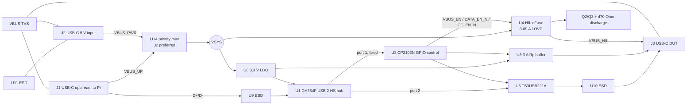
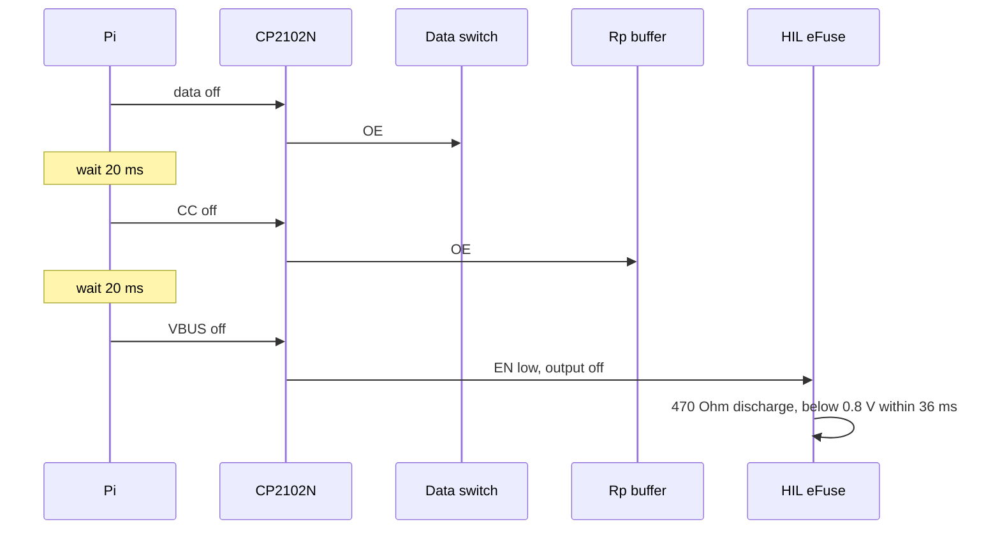
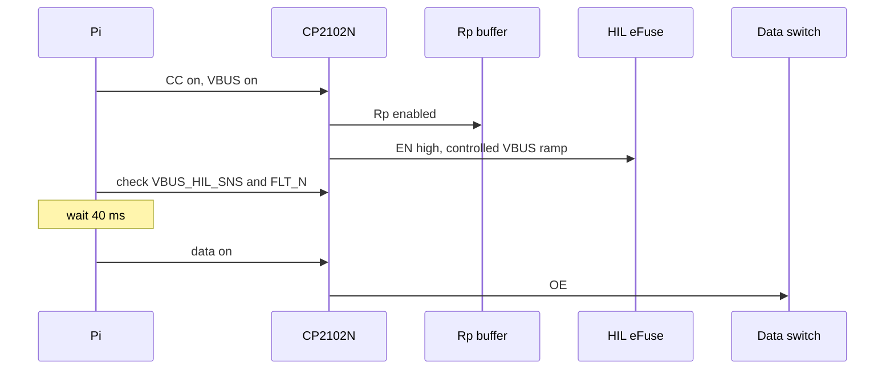
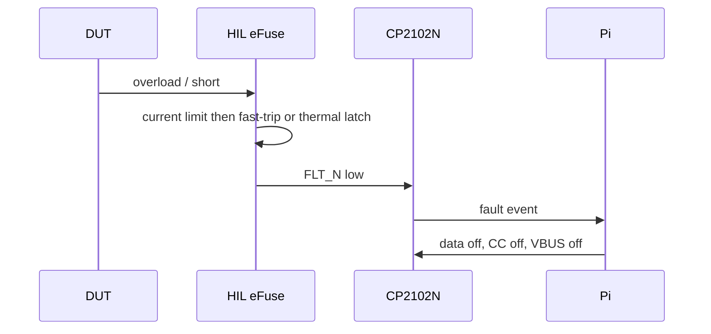

# HIL USB-C Control - Schematic-Level Architecture (v1)

Status: Draft for review round 1. This is a complete, standalone architecture derived from `product_description.md`; prior designs are archived in `architecture/V1/`.

## 0. Scope and decisions

| Area | Decision |
|---|---|
| USB topology | USB 2.0 High-Speed hub: one permanent control port and one switchable DUT port |
| Control IC | CP2102N-A02-GQFN28, exposed to Linux as a `cp210x` gpiochip |
| Input power | U14 TPS2121RUXR (C485916) J2-preferred dual-input priority mux with reverse-current blocking; J1 is the fallback |
| HIL power | One TPS259470L eFuse on J3 VBUS: 3.89 A current limit, OVP, fault output, controlled ramp and discharge |
| HIL CC | Software-enabled fixed 3 A Rp from 3.3 V: 4.79 kOhm per CC pin |
| Safety policy | Software sequences CC, VBUS and data. There is no hardware DUT-attach detector or source-capability detector. |
| PCB | Four layers, target 60 x 40 mm, no enclosure, top-side SMT with through-hole connector-shell pegs |
| Excluded | USB 3.x, USB PD, BC1.2, SBU, VCONN, DisplayPort and barrel jack |

**Qualified-input boundary:** J1 and J2 accept regulated 5 V only. They are not specified to survive or block a sustained 12 V or 20 V input. A USB-C PD source remains at vSafe5V because the board has no PD communication, but a PD trigger, a non-compliant source, or a 12 V supply is outside the product contract. Input TVS devices handle ESD and short hot-plug transients, not a sustained wrong-voltage supply.

## 1. Requirements traceability

| Requirement / scenario | How v1 satisfies it |
|---|---|
| Pi host, DUT device | J1 is the USB-C upstream connection to the Pi USB-A host port. J3 is a downstream USB-C DFP. |
| USB 2.0 HS only | CH334F hub, TS3USB221A HS switch, 90 Ohm differential routing and 0.5 pF ESD arrays. |
| Control survives DUT disconnect | CP2102N is fixed on hub port 1; only hub port 2 to J3 is switched. |
| Emulated unplug | U5 opens D+/D-, U6 removes Rp, U4 opens/discharges VBUS; software timing is mandatory. |
| Pi-powered low-current test | U14 selects J1 when J2 is absent. Software only permits a known low-current DUT. |
| External 3 A test | U14 selects J2 whenever valid. Fixture requires 5 V, at least 3.5 A, including board load. |
| Split-cable fixture | J1 accepts isolated external VBUS while Pi provides D+/D-/GND. A cable that ties external VBUS to the Pi is prohibited. |
| Never back-feed Pi | U14 reverse-blocks both inputs; J1 carries no HIL load when J2 is present. |
| HIL overload / short | U4 current limit, fast-trip, thermal latch-off and `HIL_FLT_N` report to software. |
| Deterministic default | CP2102N reset latches and pull resistors keep data open, Rp off, U4 EN low and discharge on. |
| Input fault scope | Only qualified 5 V inputs supported; connector TVS covers ESD/transients, not sustained 12/20 V. |

## 2. Topology and control-IC evaluation

| Option | Evaluation | Decision |
|---|---|---|
| USB 2.0 hub with separate control and DUT ports | Control stays enumerated while J3 is removed; true downstream data isolation is possible. | **Selected** |
| USB mux/data switch only | The CP2102N and DUT cannot coexist on one Pi port. | Rejected |
| Hub port power control only | Does not remove CC or guarantee D+/D- isolation. | Rejected |
| MCU plus hub | Enables richer policy and telemetry but adds firmware, update and debug responsibility. | Rejected for v1 |

| Candidate | GPIO and Linux support | Cost / availability posture | Result |
|---|---|---|---|
| Original CP2102 | No general GPIO | Inadequate | Rejected |
| **CP2102N-A02** | Seven GPIO lines through upstream `cp210x` gpiochip; `libgpiod` control | JLC Extended, archived C964632 | **Selected** |
| CH340 / CH9102 | Serial control only; no suitable standard gpiochip path | Low cost but insufficient GPIO | Rejected |
| FT231X / FT232H | GPIO through `ftdi_sio` / MPSSE | Higher cost; valid fallback | Alternative |
| RP2040 / CH32V / STM32 | Full GPIO and logic via CDC serial | Needs maintained firmware | Rejected |

## 3. Block diagram



## 4. Power tree and budget

| Rail | Source / path | Design current | Function |
|---|---|---:|---|
| VBUS_UP | J1 | Pi-port-limited | Low-current fallback source |
| VBUS_PWR | J2 | Qualified 5 V / >=3.5 A | Preferred high-current source |
| VSYS | U14 priority mux | 4.2 A | Board and U4 input |
| +3V3 | U8 TLV76733DRVR | 150 mA | Hub, CP2102N, U5/U6, LEDs |
| VBUS_HIL | U4 TPS259470L | 3.89 A nominal | DUT power |

| Consumer | Rail | Typical | Maximum / allowance |
|---|---:|---:|---:|
| CH334F | +3V3 | 42 mA | 85 mA |
| CP2102N | +3V3 | 9.5 mA | 14 mA |
| U5/U6 and logic | +3V3 | 1 mA | 3 mA |
| LEDs | mixed | 5 mA | 7 mA |
| Regulators / mux Iq | VSYS | 2 mA | 5 mA |
| Board total | VSYS | about 60 mA | 115 mA |

A full 3 A DUT requires at least 3.115 A before connector/cable headroom. The specified J2 fixture source is 5 V and at least 3.5 A. A nominal 3 A charger is not a full-3-A DUT source.

## 5. Schematic implementation

### 5.1 Connectors, power mux and 3.3 V rail

- **J1/J3:** TYPE-C-31-M-12, 16-pin USB 2.0 receptacle with four through-hole shell pegs, LCSC C165948 (archived-verified; recheck stock before order). Join A6/B6 as D+ and A7/B7 as D-. SBU1/SBU2 are explicitly NC with no routed stub and no ESD device because no alternate mode is supported; this is an accepted bench-only ESD limitation.
- **J2:** TYPE-C-31-M-17, six-pin power-only USB-C receptacle, LCSC C283540 (archived-verified; recheck stock). It has VBUS, GND and CC only; no D+/D- path exists to invoke proprietary charging protocols.
- **U14:** TPS2121RUXR (Texas Instruments), LCSC C485916, VQFN-HR-12 2 x 2.5 mm, Extended, $1.044 and 37,201 stock in the Konnect JLC cache. Connect J1 to IN1 (pin 7) and J2 to IN2 (pin 2). Strap PR1 (pin 6) to GND and CP2 (pin 3) to J2 VBUS; CP2 above its 1.06 V reference and PR1 below it explicitly select IN2 whenever J2 is valid. With J2 absent or invalid, IN1 supplies the output. Tie OV1/OV2 (pins 5/4) to GND because inputs are qualified 5 V; connect ST (pin 9) to a 10 kOhm pull-up to +3V3 and GPIO.7/DNP test pad for source-status observation. Set ILIM (pin 10) and SS (pin 11) per the TI equations. The 56 mOhm integrated path and reverse-current blocking prevent J1 from sharing the J2 HIL load. Do not substitute a plain ideal-diode OR circuit.
- U14 is the only isolation element between J1 and J2. Its specified reverse blocking is verified by prototype test, but component failure is not guaranteed open-circuit. This attended, qualified-fixture board is not an independent-source isolator. Label J1/J2 accordingly and test J2 back-voltage with J1 active and vice versa.
- **U8:** TLV76733DRVR, LCSC C2848334 (archived-verified; recheck stock). IN=VSYS, EN=IN, OUT=+3V3, FB/SNS=OUT. C16 1 uF at IN; C17 10 uF/25 V and C18 100 nF at OUT.
- Add 100 kOhm / 100 kOhm dividers from VBUS_UP and VBUS_PWR to GPIO.3 and GPIO.1. Each provides 2.5 V at a valid 5 V input. They are informational and do not control U14.

### 5.2 HIL VBUS and discharge

- **U4:** TPS259470LRPWR, LCSC C3662793 (archived-verified; recheck stock). IN=VSYS, OUT=VBUS_HIL. C9 10 uF + C10 100 nF at IN. For output transient performance fit C11/C12 as two 10 uF/0805/25 V X5R capacitors in parallel plus C13 100 nF; total nominal bulk is 20 uF. Validate <100 mV sag for a 0-to-3 A load step.
- EN/UVLO is `EN_HIL`: CP2102N GPIO.4 -> R27 1 kOhm -> EN; R28 100 kOhm EN-to-GND. This yields a deterministic disabled state before GPIO configuration.
- ILM: R31=931 Ohm, 0402, 0.1%, LCSC C852955. The TPS259470L data sheet specifies 3.96/4.452/4.84 A min/typ/max at RILM=750 Ohm. Scaling that specified band by $750/(931 \times 1.001)$ and $750/(931 \times 0.999)$ gives 3.19-3.90 A; nominal is 3.59 A. This retains a 3 A DUT margin while bounding maximum current below 4.0 A. Validate the trip response and thermal behavior on prototype, but no further current-limit tolerance derivation is pending.
- OVLO: R29 49.9 kOhm (VSYS to OVLO) and R30 12 kOhm (OVLO to GND), yielding 6.19 V rising / 5.67 V falling. SMAJ6.5A has 6.5 V standoff, not a 6.5 V clamp; it does not suppress a 6.19 V OVLO trip. DVDT C14=1 nF. ITIMER open. FLT has R34 10 kOhm pull-up to +3V3 and reaches GPIO.0.
- Discharge: Q2 and Q3 are BSS138P,215 (C75547, SOT-23, Extended; 463,528 stock in the Konnect cache). R36 470 Ohm/0805 is from VBUS_HIL to Q3 drain; Q3 source is GND. Q3 gate has R37 100 kOhm pull-up to +3V3. When EN_HIL is high, Q2 conducts and pulls Q3 gate low, turning Q3 off so discharge is disabled. When EN_HIL is low, Q2 releases the gate and R37 turns Q3 on, enabling discharge. Q3 on resistance is negligible compared with 470 Ohm; the nominal 20 uF output discharges from 5 V to 0.8 V in 17 ms. `hil_off()` must report a discharge fault if its 150 ms confirmation timeout expires.
- `VBUS_HIL_SNS`: R38 10 kOhm from VBUS_HIL, R39 18 kOhm to GND, and R40 1 kOhm series to GPIO.2. At 5 V, GPIO sees 3.21 V.

### 5.3 USB hub, control and switched data

- **U1:** CH334F, LCSC C5187527 (archived-verified; recheck stock). Operate in 3.3 V self-powered mode: V5 and VDD33 to +3V3, each with 1 uF + 100 nF. Strap PSELF for the confirmed self-powered polarity. Y1 is X322512MSB4SI 12 MHz, LCSC C9002; external 22 pF load capacitors are DNP because CH334F provides internal loading.
- Hold U1 RESET#/CDP low while J1 VBUS is absent using Q6/Q7, both BSS138P,215/C75547. Q6 source=GND, drain=U1 RESET#, gate=`HUB_RESET_CTL`; R45=100 kOhm pulls RESET# to +3V3. Q7 source=GND, gate=VBUS_UP, drain=`HUB_RESET_CTL`; R46=100 kOhm pulls `HUB_RESET_CTL` to +3V3. With VBUS_UP absent, Q7 is off, Q6 gate is high, and Q6 asserts reset; with VBUS_UP present, Q7 pulls Q6 gate low and R45 releases reset. Never actively drive RESET# high. Confirm PSELF and reset behavior on prototype.
- **U2:** CP2102N-A02-GQFN28R, LCSC C964632 (archived-verified; recheck stock). U2 D+/D- connect to fixed U1 port 1. VDD gets 1 uF + 100 nF; VREGIN gets 1 uF. VBUS sense pin uses R43=22 kOhm from VSYS and R44=47 kOhm to GND.
- **U5:** TS3USB221ARSER, LCSC C128396 (archived-verified; recheck stock). Hub port 2 connects to common D+/D-; J3 connects to 1D+/1D-. Select=GND; 2D+/2D-=NC; OE#=`HIL_DATA_EN_N`; VCC=+3V3 with 100 nF.

### 5.4 CC, Rp, inputs and controls

- J1/J2 each have Rd: R1-R4, 5.1 kOhm from each CC pin to GND. This establishes a Type-C sink and makes a compliant J2 source apply vSafe5V.
- **U6:** SN74LVC1G125DBVR, LCSC C23654 (archived-verified; recheck stock). VCC=+3V3 with 100 nF; A=+3V3; OE#=`HIL_CC_EN_N`; Y=`VRP_3A`. It must offer power-off output isolation.
- From `VRP_3A` to J3 CC1 fit R5=33 kOhm in parallel with R7=5.6 kOhm; to J3 CC2 fit R6=33 kOhm in parallel with R8=5.6 kOhm. Each leg is 4.79 kOhm and yields about 1.70 V with a 5.1 kOhm Rd at 3.3 V, advertising 3 A. Do not fit auxiliary 1 Mohm CC pull-ups: U6 output isolation leaves the line genuinely open when disabled.
- There is no PD controller, BC1.2 detector, VCONN or dynamic Rp. J3 advertises 3 A even in Pi fallback mode; software must prevent inappropriate loads.

## 6. Control interface and Linux contract

| CP2102N pin | Net | Mode | Active state | Default |
|---:|---|---|---|---|
| GPIO.4 (22) | HIL_VBUS_EN | push-pull output | high enables U4 | low |
| GPIO.5 (21) | HIL_DATA_EN_N | open-drain output | low enables U5 | released / high |
| GPIO.6 (20) | HIL_CC_EN_N | open-drain output | low enables U6 Rp | released / high |
| GPIO.0 (19) | HIL_FLT_N | input | low = U4 fault | pull-up |
| GPIO.1 (18) | VBUS_PWR_SNS | input | high = J2 present | divider |
| GPIO.2 (17) | VBUS_HIL_SNS | input | high = HIL VBUS present | divider |
| GPIO.3 (16) | VBUS_UP_SNS | input | high = J1 present | divider |

`VBUS_PWR_SNS`: R70=100 kOhm from VBUS_PWR, R71=100 kOhm to GND, R72=1 kOhm series to GPIO.1. `VBUS_UP_SNS`: R73=100 kOhm from VBUS_UP, R74=100 kOhm to GND, R75=1 kOhm series to GPIO.3. Both use 3.3 V-tolerant GPIO inputs only.

| VBUS_EN | CC_EN_N | DATA_EN_N | J3 state |
|---:|---:|---:|---|
| 0 | 1 | 1 | Disconnected: VBUS discharged, Rp absent, D+/D- open |
| 0 | 0 | 1 | Rp present, VBUS/data off |
| 1 | 0 | 1 | VBUS and Rp present; data open |
| 1 | 0 | 0 | Connected: VBUS, Rp and data present |

Use one persistent service to own GPIO lines. It must write default-off values when requesting the lines.

```python
# Line values use active-low names for data and CC.
def hil_off():
    data_en_n.set(1); sleep(0.020)
    cc_en_n.set(1); sleep(0.020)
  vbus_en.set(0)
  if not wait_until(lambda: not vbus_hil_sns.get(), timeout=0.150):
    raise RuntimeError("VBUS discharge timeout")

def hil_on(high_current=False):
    if high_current and not vbus_pwr_sns.get():
        raise RuntimeError("qualified J2 source required")
    cc_en_n.set(0)
  sleep(0.010)  # Allow Rp to settle before presenting VBUS.
    vbus_en.set(1)
    wait_until(lambda: vbus_hil_sns.get() and hil_flt_n.get(), timeout=1.0)
    sleep(0.040)
    data_en_n.set(0)
```

## 7. Sequences and fail-safe states







| Condition | J3 state | Mechanism |
|---|---|---|
| Power-up, U2 reset, failed enumeration | Disconnected | GPIO latches and pull resistors |
| Pi reboot | Disconnected until service starts | Same defaults |
| U4 thermal fault | VBUS off, FLT low | U4 latch-off; service disables all outputs |
| DUT physically unplugged | Can remain powered until service turns it off | Accepted software-only limitation |
| J2 added while J1 present | J2 supplies VSYS, J1 reverse-blocked | U14 priority mux |

## 8. ESD, indicators, test points and layout

| Location | Protection / implementation |
|---|---|
| J1 D+/D-/CC1/CC2 | U9 TPD4E05U06DQAR, C138714, 0.5 pF ESD array |
| J3 D+/D-/CC1/CC2 | U10 TPD4E05U06DQAR, C138714 |
| J2 CC1/CC2 | U11 TPD4E05U06DQAR, C138714; unused channels grounded |
| J1/J2 VBUS | SMAJ20A, C115250. Transient/ESD support only; sustained incorrect voltage is unsupported. |
| J3 VBUS | SMAJ6.5A, C123817, coordinated with U4 OVLO |
| LEDs | Green VSYS, yellow VBUS_HIL, red +3V3-to-FLT_N; 1 kOhm each |
| Test points | VBUS_UP, VBUS_PWR, VSYS, +3V3, VBUS_HIL, GND, U4 ILM/EN/FLT, three GPIO enables, three GPIO senses, D+/D- in-route vias |

- Shells go directly to GND with short, wide copper and at least four stitching vias per connector. Reserve DNP 1 Mohm || 4.7 nF chassis-link footprints only if a metal enclosure is added.
- Use four layers: L1 signals/components, L2 solid GND, L3 VSYS/VBUS_HIL pours, L4 low-speed signals. Route USB at 90 Ohm differential impedance using JLC's chosen four-layer stack-up, <0.15 mm skew, no stubs and <=2 vias per pair.
- Floor plan: J1 left edge; U9 then U1/Y1 left-center; J2 top edge beside U14 and input TVS; U4/bulk capacitors top-right; U5/U10 between U1 and J3 on right edge; U2 bottom-center; U8 near the 3.3 V loads. Keep ESD within 3 mm of connector pins and switching/high-current loops away from Y1/U1.
- Barrel jack is dropped: a safe third source needs reverse blocking and a qualified OVP path, exceeding the three-part target. Use a regulated USB-C supply at J2.
- Thermal target: U14 dissipation at 3.12 A is approximately $3.12^2 \times 56\ m\Omega = 0.55\ W$ nominal. U4 is approximately $3^2 \times 17\ m\Omega = 0.15\ W$ using its typical on resistance. Place U14 and U4 over copper pours with at least four thermal vias. U8 worst-case dissipation is $(5.25-3.3) \times 0.115 = 0.22\ W$. At 3 A DUT load from J2, measure 10-minute temperature rise; no device may thermal-shutdown and U14/U4 package surface rise should remain below 40 C above ambient.
- Before PCB layout, select the current JLC four-layer impedance stack-up in its impedance calculator and record its 90 Ohm differential width/spacing in the PCB constraints. This architecture does not freeze a stack-up code that JLC could change.

## 9. BOM summary and procurement status

| Group | Approx. qty | Cost at qty 10 | Status |
|---|---:|---:|---|
| ICs, connectors, TVS, FETs, LEDs | 20 | $8-11 | Includes Q2/Q3/Q6/Q7; all core entries were rechecked in the Konnect cache below |
| Resistors | 38 | about $0.35 | 0402 except 470 Ohm discharge 0805 |
| Capacitors | 25 | about $0.90 | Include 20 uF output bulk and VSYS bulk |
| Total | about 80 placements | $10-14 plus assembly fees | Provisional |

| Passive / refdes | Value and package | LCSC | Qty |
|---|---|---|---:|
| R1-R4 | 5.1 kOhm, 0402, 1% | C25905 | 4 |
| R5/R6 | 33 kOhm, 0402, 1% | C25779 | 2 |
| R7/R8 | 5.6 kOhm, 0402, 1% | C25908 | 2 |
| R27/R34/R38/R40/R72/R75 and LED resistors | 1 kOhm, 0402, 1% | C11702 | 9 |
| R28/R37/R45/R46/R70/R71/R73/R74 | 100 kOhm, 0402, 1% | C25741 | 8 |
| R29 | 49.9 kOhm, 0402, 1% | C25897 | 1 |
| R30 | 12 kOhm, 0402, 1% | C25752 | 1 |
| R31 | 931 Ohm, 0402, 0.1% | C852955 | 1 |
| R36 | 470 Ohm, 0805 | C17710 | 1 |
| R38/R39/R43/R44 | 10 kOhm / 18 kOhm / 22 kOhm / 47 kOhm, 0402, 1% | C25744 / C25762 / C25768 / C25792 | 4 |
| C1/C3 | 4.7 uF, 0805, 25 V X5R | C1779 | 2 |
| C9/C11/C12/C17 | 10 uF, 0805, 25 V X5R | C15850 | 4 |
| C5/C37 | 47 uF, 1206, 10 V X5R | C96123 | 2 |
| C14 | 1 nF, 0402 | C1523 | 1 |
| C16/C19/C21/C23/C25 | 1 uF, 0402, 25 V X5R | C52923 | 5 |
| Local bypass capacitors | 100 nF, 0402, 16 V X7R | C1525 | 11 |

Active FETs: Q2/Q3/Q6/Q7 are BSS138P,215, LCSC C75547, SOT-23, Extended; 463,528 stock in the Konnect cache. Konnect cache verification at this revision: U14 TPS2121RUXR/C485916 (37,201 stock); U4 TPS259470LRPWR/C3662793 (2,842); U2 CP2102N/C964632 (42,417); U1 CH334F/C5187527 (4,767); U5 TS3USB221A/C128396 (92,432); U6 SN74LVC1G125/C23654 (102,950); U8 TLV76733/C2848334 (20,010); ESD C138714 (175,385); J1/J3 C165948 (93,517); J2 C283540 (9,051). No listed selected core part is below 1,000 stock or marked EOL in that cache.

## 10. Assumptions, risks and prototype tests

### Assumptions and accepted shortcuts

- Board target is 60 x 40 mm with no enclosure; this is an engineering default awaiting confirmation.
- J2 is a qualified 5 V, >=3.5 A fixture source. Sustained 12/20 V at J1/J2 is unsupported.
- Pi-only operation is software-limited to known low-current DUTs even though J3 advertises 3 A.
- A split cable isolates Pi VBUS from the external 5 V leg.
- HIL off after reset/fault is acceptable.
- There is no automatic physical-detach shutdown: a physically removed DUT can leave J3 VBUS live until the service disables it.

### Open questions

1. Confirm CH334F PSELF polarity and reset/pull-up behavior on prototype.
2. Program CP2102N with Silicon Labs Xpress Configurator before release: GPIO.4 push-pull reset low; GPIO.5/6 open-drain reset high; GPIO.0-3 digital inputs; self-powered, 100 mA. The released production package must contain `cp2102n_config.hex`, generated from this exact manifest, plus its SHA-256 and serial-number policy; do not allow blank parts into PCBA. Program and read back each unit before final test.
3. Confirm on a fresh Raspberry Pi OS image that `/dev/gpiochipN [cp210x]` exposes all seven lines and that the chosen GPIO levels work at 3.3 V.
4. Confirm acceptance of Pi-powered low-current operation with fixed 3 A Rp.
5. Confirm the board envelope and whether an enclosure changes the shell grounding approach.

### Mandatory prototype tests

1. With J1 and J2 present at 3 A DUT load, verify J1 current is negligible and J2 is the sole HIL source.
2. Remove J2 at 0.5 A, 1.1 A and 3 A; verify the service disables U4 and characterize reset behavior.
3. Verify the complete data/CC/VBUS disconnect and reconnect sequences, including VBUS <0.8 V in 60 ms.
4. Verify USB HS eye/throughput through U5 and disconnect/re-enumeration behavior.
5. Verify U4 current-limit, fast-trip, thermal latch, FLT report and recovery.
6. Verify Pi-powered known-low-current DUTs do not trip the Pi port.
7. Verify qualified J2 high-current operation, voltage drop and thermal rise at the full DUT load.
8. Verify U14 reverse blocking: drive one input at 5 V, leave the other unpowered or short it to GND through a current meter, and require <=10 uA reverse current. Repeat for both input directions.
9. Verify IEC 61000-4-2 bench robustness: +/-4 kV contact to accessible connector pins and +/-8 kV air to shells, both with DUT traffic active; no latch-up, no HIL enable without a software command, and USB re-enumeration within 2 seconds.
10. At a 0-to-3 A load step, verify VBUS_HIL sag below 100 mV; also remove J2 while U4 is current-limiting and verify a defined fault/off state.
11. Mate J2 with at least five representative USB-C 5 V sources and verify CC attach, 5 V delivery, and retention. Qualify an alternate connector before production if any fail.
12. Perform ten HIL connect/disconnect cycles at ten-second intervals; no false eFuse trip, enumeration hang, or recovery latency above two seconds is allowed.

## 11. Review response log - round 1

| Finding | Decision | v2 response |
|---:|---|---|
| 1 U14 unverified | Accepted | Selected TPS2121RUXR, C485916, VQFN-HR-12; stock and price verified in Konnect cache. |
| 2 Q2/Q3 unspecified | Accepted | Named BSS138P,215/C75547 and corrected discharge truth description. |
| 3 incomplete passives | Accepted | Added named sense/Rp/Rd networks and passive procurement schedule. |
| 4 secondary reverse block | Rejected | A series Schottky wastes 5 V margin; U14 is the specified reverse-blocking boundary. Failure limitation, labels, and reverse-current test are explicit. |
| 5 CP2102N production risk | Accepted | Added programming image/configuration and fresh-Pi GPIO validation gate. |
| 6 mux failure mode | Accepted | Documented attended-fixture limitation and reverse-isolation test. |
| 7 contradictory discharge wording | Accepted | Rewritten with explicit transistor states. |
| 8 unnamed dividers | Accepted | Added R70-R75 definitions. |
| 9 weak CC pull-ups | Accepted | Removed; U6 power-off isolation is the off-state mechanism. |
| 10 thermal analysis | Accepted | Added power estimate, thermal layout and prototype target. |
| 11 stack-up unspecified | Accepted | Added pre-layout JLC impedance-calculator gate. |
| 12 ESD test | Accepted | Added IEC bench test. |
| 13 provisioning | Accepted | Added CP2102N configuration image/manufacturing requirement. |
| 14 split-cable detection | Accepted limitation | Software treats J1 fallback as low-current unless the fixture explicitly declares a qualified split supply; no inference from voltage sag. |
| 15 no detach detector | Accepted limitation | Controlled, attended-fixture scope; the service owns the off sequence. |
| 16 fault logging | Accepted | Service must log FLT and source-sense transitions and require operator acknowledgement before fault retry. |

## 12. Review response log - round 2

| Finding | Decision | v3 response |
|---:|---|---|
| C1 TVS/OVLO interaction | Resolved | Clarified SMAJ6.5A 6.5 V is standoff, not clamp voltage; U4 OVLO is 6.19 V rising and trips first. |
| C2 U4 ILM tolerance | Resolved pending vendor confirmation | Replaced parallel network with verified 866 Ohm/1% C227251, 3.85 A nominal and 3.81-3.89 A resistor-only range; datasheet/prototype current-limit validation is a release gate. |
| C3 U14 priority unspecified | Resolved | Added pin-level `J1->IN1`, `J2->IN2`, `PR1->GND`, `CP2->J2` XREF configuration and fallback behavior from TI TPS2121 data sheet. |
| C4 CP2102N image absent | Release artifact gate | Architecture now specifies exact configuration and mandatory generated/read-back `cp2102n_config.hex`; binary image is a manufacturing release artifact, not fabricated in this architecture-only phase. |
| M1 discharge timeout | Resolved | Added 150 ms confirmation timeout and error path. |
| M2 CC/VBUS race | Resolved | Added 10 ms CC-settle delay before VBUS enable. |
| M3 U14 single-point failure | Accepted limitation | Retained attended-qualified-fixture limitation; added labels, fault logging, and nominal reverse-current test. No Schottky is added because its drop erodes the 5 V margin. |
| M4 output transient | Resolved as prototype gate | Replaced 22 uF/1206 output capacitor with two 10 uF/0805 parts and added <100 mV 3 A step test. |
| M5 J2 compatibility | Resolved as prototype gate | Added five-source mating/attach qualification and alternate-connector trigger. |
| M6 GPIO levels | Release gate | Fresh-Pi OS gpiochip/level measurement remains mandatory before production release. |
| M7 thermal model | Resolved as prototype gate | Thermal layout and 10-minute full-load test remain required before production release. |
| M8 supply alternatives | Accepted procurement procedure | Cache stock is acceptable for prototype; production BOM release must add alternates or waive each single-source part. |

## 13. Review response log - round 3

| Finding | Decision | v4 response |
|---:|---|---|
| CRIT-1 output capacitor BOM mismatch | Resolved | C11/C12 are two 10 uF/0805 C15850 parts; nominal output bulk is 20 uF and the discharge calculation is 17 ms. |
| MAJ-1 missing Q6/Q7 | Resolved | Added complete BSS138P reset-control topology, R45/R46, four-FET active schedule, and exact LCSC mapping. |
| MIN-1 U4 thermal power | Resolved | Added 0.15 W nominal U4 dissipation estimate. |
| MIN-2 SBU handling | Resolved | Declared no-stub, no-ESD SBU handling as a bench-only accepted limitation. |

## 14. Review response log - round 4

| Finding | Decision | v5 response |
|---:|---|---|
| M-1 U4 current-limit final tolerance | Resolved | Replaced 866 Ohm with 909 Ohm C327324. The TPS259470L published 750 Ohm min/typ/max limits scale to 3.27-4.00 A including the 1% resistor; nominal is 3.67 A. Product brief aligned. |
| MIN-1 discharge timeline | Clarified | 17 ms is the 20 uF/470 Ohm nominal calculation; the 36/60/150 ms values are software/test margins. |
| MIN-2 CC/VBUS timing | Accepted refinement | 10 ms CC-settle delay remains an architecture-level implementation requirement. |
| MIN-3 CH334F prototype behavior | Release gate | PSELF/reset prototype verification remains mandatory but is fully specified for capture. |

## 15. Post-review correction

The fifth independent review found no Critical or Major defects. A subsequent arithmetic check showed that its acceptance of the prior 909 Ohm R31 maximum rounded $4.034$ A down to 4.0 A. To make the product brief's strict below-4.0-A statement true, R31 is changed to C852955 (931 Ohm, 0.1%). The exact data-sheet-scaled bounds are 3.1869 A minimum, 3.5865 A typical, and 3.9029 A maximum. This is a self-contained numerical correction; it does not alter topology, controls, CC behavior, layout, or any review disposition.
