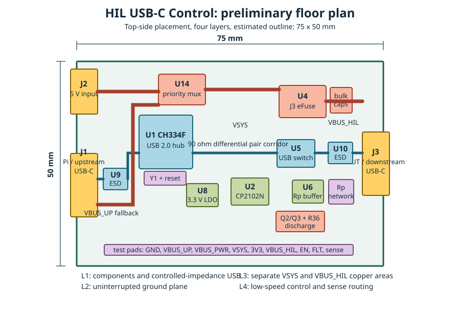

# Preliminary PCB Floor Plan

## Size estimate

Use a **75 x 50 mm** rectangular four-layer outline for the first layout. This is a planning estimate, not a released mechanical dimension.

The existing 60 x 40 mm target is physically possible only if the connector footprints, chosen four-layer impedance stack-up, thermal spreading, and full routing all fit without compromises. It is a compact variant to evaluate after placement. The 75 x 50 mm starting outline leaves useful margin for the 3 A path, thermal copper around U14/U4, accessible test pads, and controlled-impedance USB routing.

| Outline | Area | Status |
|---|---:|---|
| 60 x 40 mm | 2,400 mm2 | Original compact target; high placement and thermal risk |
| **75 x 50 mm** | **3,750 mm2** | **Recommended initial layout estimate** |

## Placement intent

- **Left short edge:** J2 occupies the upper position and J1 the lower position. J2 feeds U14 `IN2` through a short, wide preferred-power path; J1 VBUS feeds U14 `IN1` through a separate wide fallback-power path, while J1 D+/D- pass through their ESD array to the hub (U1).
- **Upper-left interior:** U14 stays beside J2, with enough copper and thermal vias for the priority-mux heat spreading. Keep the J2 power path separate from the J1 USB pair.
- **Right edge:** U5, U10, and J3 form the switched downstream USB path. Put the Rp buffer and resistor network close to J3 CC pins.
- **Upper-right:** U4, its input/output capacitors, output TVS, and the Q2/Q3/R36 discharge circuit. Place the discharge components next to U4 OUT, not near the USB path.
- **Lower center:** U2 and its low-speed GPIO/sense network. U8 sits between the power and 3.3 V load clusters, with local bypass capacitors at every IC.
- **Bottom edge:** Accessible test pads. Keep USB pair probe vias separate from power and GPIO test pads.

## Layout constraints to validate

| Item | Constraint |
|---|---|
| USB 2.0 pairs | 90 ohm differential impedance from the selected fabricator stack-up; under 0.15 mm pair skew; at most two vias per pair |
| ESD placement | Within 3 mm of the applicable USB-C connector pins |
| U4 capacitors | C11/C12/C13 directly adjacent to U4 OUT, with short ground returns |
| Power path | U14 OUT to U4 IN and U4 OUT to J3 VBUS use wide copper sized from the final stack-up/current calculation |
| Thermal relief | Thermal-via arrays beneath U14 and U4 tied to their respective copper areas; verify with a 3 A, 10-minute load test |
| Planes | L2 remains solid GND. L3 holds separate `VSYS` and `VBUS_HIL` copper; they connect electrically only through U4, never by a direct copper bridge. |

## Three-pass review result

1. Initial feasibility review: 60 x 40 mm is possible but crowded by three connectors, two high-speed corridors, bulk capacitors, and U14 thermal spreading.
2. Geometry review: 75 x 50 mm gives the smallest comfortable initial working area for component placement, test access, and separate power regions.
3. Consistency review: retained 60 x 40 mm as a cost/compactness target, corrected the power-plane topology, and made the 75 x 50 mm dimension an estimate pending footprint placement and thermal validation.

Before freezing the outline, select the actual USB-C footprints and JLC four-layer stack-up, place all footprints, then verify clearance, impedance, and temperature rise at 3 A.