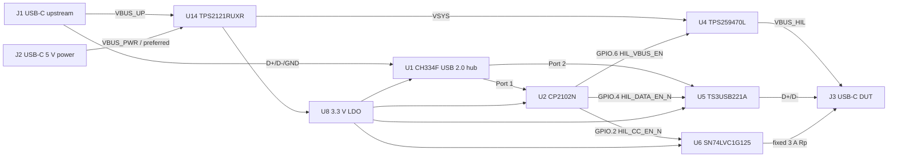

# Schematic overview

This is an implementation map for the final reviewed architecture. It does not replace [`architecture_final.md`](architecture_final.md), which is the source for exact values, part numbers, and validation gates.

## Net-level block topology

## Sheet / placement partitions

| Partition | Contents | Critical routing / placement rule |
|---|---|---|
| J1 upstream and hub | J1, U9, U1, Y1, Q6/Q7 | Keep USB pairs short and 90 Ohm differential. Keep Y1 away from high-current copper. |
| Power entry and priority | J2, input TVS, U14, U8 | J2 is U14 IN2; J1 is IN1. Strap PR1 to GND and CP2 to J2 VBUS. Keep VSYS copper wide and U14 thermal vias under pad. |
| HIL output | U4, C9-C13, Q2/Q3, R36, J3 VBUS | Put input/output capacitors at U4 pins. Keep the VBUS_HIL and discharge loop compact. |
| DUT data and CC | U5, U6, U10, Rp resistors, J3 | Keep U5 USB routing continuous and short. Place U10 directly behind J3. Keep CC traces away from D+/D-. |
| Control and test | U2, sense dividers, FLT pull-up, test points | Bring all enables, senses, ILM, FLT, VSYS and both input VBUS nets to labelled test points. |

## PCB floor plan

- Left edge: J1; then U9 and U1/Y1 toward the left-center.
- Top edge: J2, input TVS, U14 and its VSYS bulk capacitors.
- Top-right: U4, output capacitors and the Q2/Q3 discharge loop.
- Right edge: J3 with U10 immediately behind it; U5/U6 between U1 and J3.
- Bottom-center: U2; place U8 next to its 3.3 V loads.
- L2 is solid ground. L3 carries VSYS and VBUS_HIL pours. Use a JLC-selected four-layer stack-up and its calculated 90 Ohm USB differential geometry.

## Build gates

- No KiCad files are included in this package.
- Use the exact component selections and pin-level constraints in [`architecture_final.md`](architecture_final.md).
- Prototype/production validation gates remain mandatory before release: CP2102N configuration/read-back, CH334F reset behavior, U14 reverse current, 3 A thermal/load-step behavior, J2 source compatibility, and ESD robustness.
